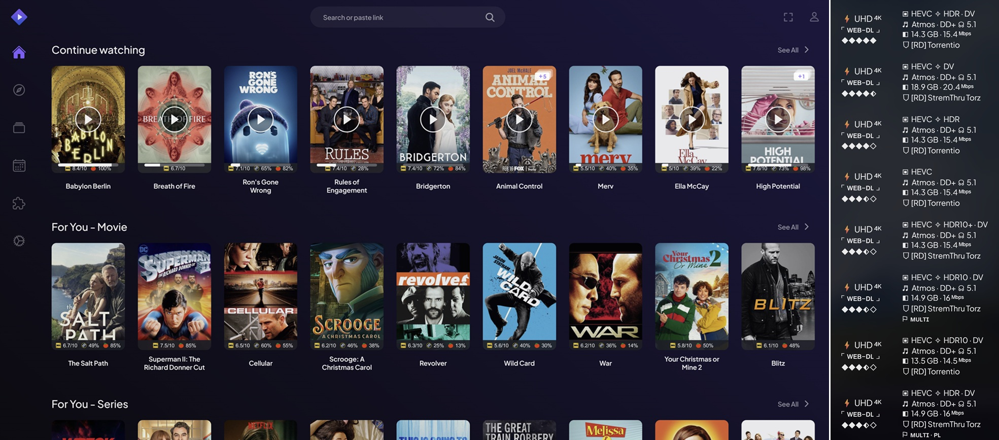

# 🎬 STREMIO FULL & EASY TOTAL BEGINNER'S GUIDE
**[⚡ DEBRID / 🧲 P2P / 🌐 HTTP]** (*v2.0*)

**If this guide helps you, PLEASE UPVOTE the [Reddit post](https://www.reddit.com/r/StremioAddons/comments/1qvn9rk/my_stremio_perfect_setup_for_me_at_least_sharing/) so it remains relevant for others to find it and also benefit from it.** 😊

After a few iterations trying out what works and what doesn't for me, and testing various addons, I think I have reached the optimal Stremio setup. Of course it's a matter of taste and everyone has different preferences, but I will share my guide here for anyone interested, or at least get started easily and then modify in reverse whatever changes they want. So here it is completely from scratch:

**Don't be scared. Although it may look like a very long guide, it's actually just a few simple steps and very easy. I just wanted to be thorough and describe everything totally step-by-step so you understand what you're doing.**

>**NOTES:**
>* **If you are a total beginner and are curious to understand the concepts around Stremio** and how it works, go to [**🔰 Beginner Concepts**](docs/guide/0-Beginner-Concepts.md).
>* If you already followed this guide and would like to **update to the latest template** (check out the version number on the title), go to [**🔔 Updates**](docs/guide/Updates.md).
>* **If you followed this guide and are encountering issues or have configuration questions**, go to [**❓ Configuration Q&A**](docs/guide/8-Configuration-QA.md). If you're just starting, remember this for later in case you need it. **PLEASE avoid asking questions that are already answered there**.
>* **🙏 A very explicit special THANKS** to the **Stremio** developers which goes without saying, and all the community collaborators without which we wouldn't be able to enjoy any of it: [**TamTaro**](https://ko-fi.com/tamtaro) for the template base and SEL filters, [**Vidhin**](https://ko-fi.com/vidhin) for the Regexes, and the addon developers [**Viren**](https://ko-fi.com/Viren070) for AIOStreams, [**Cedya**](https://buymeacoffee.com/cedya) for AIOMetadata, [**Sanopandit**](https://ko-fi.com/timilsinabimal) for Watchly, [**Sonic**](https://ko-fi.com/sonicx161) for AIOManager, the public addon instance hosters which make everything so much simpler for most, and anyone else I may have failed to mention. All of these people continue to develop and improve them actively together with the Stremio community, so shout out to all of them for their wonderful work, and consider buying them a coffee if you agree with me! Since a few of you have also asked about tipping me for helping, even though I did it for fun and an very happy if my guide helped you, [**here**](https://ko-fi.com/luckynumb3rs) is my coffee link :)

In case you are wondering whether it's worth the effort, or you already have a Torrentio + RD setup and want to know what's better if you use this guide, here's a summary:

* **Cleaner Management**: instead of one scraper and a messy pile of addons, you use *two central addons* (AIOStreams + AIOMetadata) to keep everything *clean, consistent, and easy to manage*.
* **Better Results**: AIOStreams combines *multiple scrapers/providers*, so you usually get *more working sources* and better coverage.
* **Best Links First**: smart *sorting + filtering* pushes the most relevant options to the top (cache, quality, resolution, size, reliability signals), so less scrolling and fewer bad clicks.
* **Extra Quality Signals**: on top of general sorting, *Vidhin's regexes* help *rate/identify quality releases and trusted groups* for even better ordering.
* **Cleaner Source Selection UI**: a *minimal, modern stream list view* with the info you actually need to choose fast.
* **Netflix-like Automation**: Trakt-driven *personal lists, watch tracking, and progress syncing* and a *full-blown suggestions engine with dynamic catalogs* based on what you watch and like, for a more "recommended and organized" experience.
* **Richer Browsing**: AIOMetadata gives *better catalogs + metadata integrations* (ratings, descriptions, artwork) and lets you *remove/replace Cinemeta clutter*.

**Before proceeding, it's also important to distinguish between the stream types this guide includes:**
* **⚡ DEBRID** is paid, but fast, safest and most reliable. Activated by selecting a Debrid service when you import the *AIOStreams* template.
* **🧲 P2P** is free, but slower and risky depending on the laws of your country. Activated automatically if you don't select a Debrid when you import the *AIOStreams* template.
* **🌐 HTTP** is free and safe, but slower and less reliable than Debrid. Activated if you enable the *HTTP Addons* option when you import the *AIOStreams* template.
* *In case **P2P** is an issue in your country: If you use **Debrid** (paid) or **HTTP** (free) streams, you are generally safe and don't need a VPN. **Debrid** however is still the safest and most reliable solution.*

So, now that you know, it's up to you, but if you're up for it, let's do it 💪:

- [🔰 Beginner Concepts](docs/guide/0-Beginner-Concepts.md)
- [📝 1. Accounts Preparation](docs/guide/1-Accounts-Preparation.md)
- [⚙️ 2. Stremio Account Initialization](docs/guide/2-Stremio-Initialization.md)
- [📚 3. AIOStreams [Find Streams]](docs/guide/3-AIOStreams-Setup.md)
- [🔎 4. AIOMetadata [Metadata & Catalogs]](docs/guide/4-AIOMetadata-Setup.md)
- [🧹 5. Cinebye [Clean-Up]](docs/guide/5-Cinebye-Cleanup.md)
- [🤖 6. Personalized & Automated Lists](docs/guide/6-Personalized-Lists.md)
- [🛠️ Additional Stuff](docs/guide/7-Additional-Stuff.md)
- [❓ Configuration Q&A](docs/guide/8-Configuration-QA.md)
- [🎛️ AIOManager [Power Users]](docs/guide/AIOManager-Setup.md)
- [📜 Changelog](docs/guide/Changelog.md)
- [🔔 Updates](docs/guide/Updates.md)
