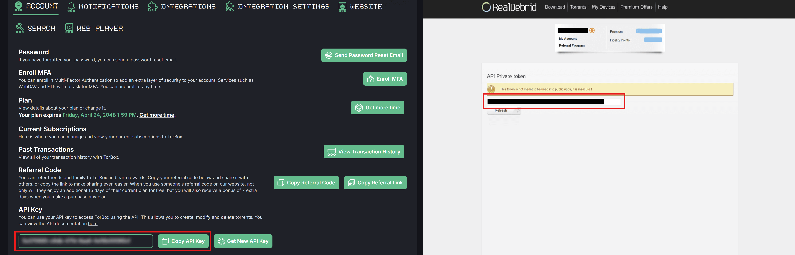
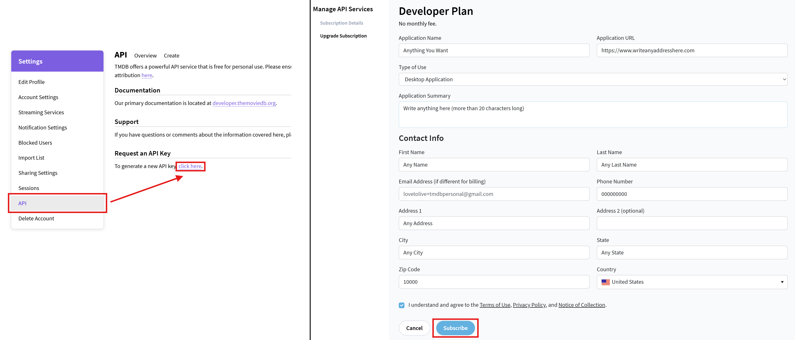
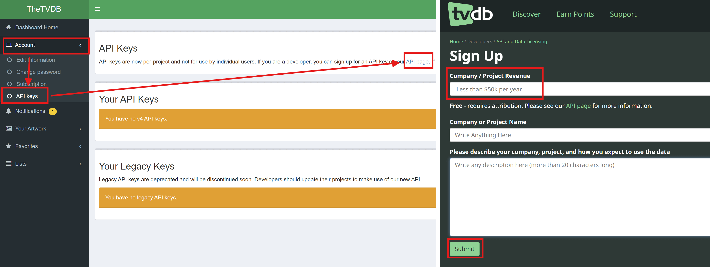
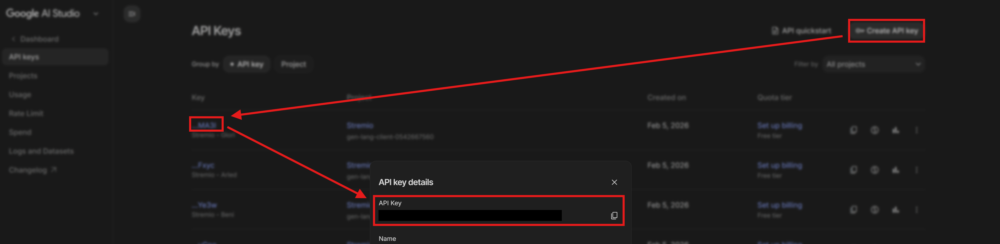

# 📝 1. Accounts Preparation
----------------------------------

First, let's start by creating the accounts (those who already have them can skip these steps):

1. Obviously, start by creating a new free [**Stremio**](https://www.stremio.com) account.
2. Choose a Debrid service for caching the torrents, create an account on it, buy a subscription, and get the API key.
   * *This is optional, but HIGHLY recommended.*
   * *For those who don't know, this is the only thing you will be paying for (about 32€ for Real-Debrid or $33 for TorBox for 12 months). It's used as an intermediary to serve the files to you from their servers, instead of relying on torrent which may be slow and inefficient. This means faster loading, almost no buffering, and more high-quality stream options. I would definitely recommend getting this.*
   * *I use mainly* [***TorBox***](https://torbox.app/subscription?referral=6e80077e-c232-4b71-8914-5b87202b9577), as a backup I use [***Real-Debrid***](http://real-debrid.com/?id=8801126) *(these are referral links since we're at it :), two of the best platforms, with the best prices and very stable.*
   * *For* ***TorBox***, *please make sure to use my referral code when ordering:* ***6e80077e-c232-4b71-8914-5b87202b9577*** *to get 7 additional days for each month you buy (only for the first purchase, so I recommend you go big from the start and buy the yearly, it's a better value and you get 84 additional days for free). You can also buy the cheapest tier for a year initially to get the extra 3 months, and if you need a higher tier, you can upgrade along the way, it is possible. You can enter it when choosing the Plan, scroll down to the bottom and there you'll see it.*
   * *To help you choose between Real-Debrid and TorBox:*
      * ***Real-Debrid*** *is one of the most widely used service, and has probably the largest cache (files already available on their servers and ready to watch) of shows and movies. However, they only allow one connection at a time, meaning that you can't watch on two or more devices simultaneously (you can log in to your Stremio account on as many devices you want, that's unrelated). So if you want to use it with friends or family or on multiple Stremio accounts to watch simultaneously, you can't: you'll get a warning and may risk getting banned if repeated.*
      * ***TorBox*** *allows in it's most basic paid option up to 3 parallel connections, and has tiers with up to 10 parallel streams, which means that you can use the same API key for e.g. your entire family or friends, or multiple Stremio accounts. However, it may not have the large cache of readily available shows like Real-Debrid has, so it might happen that you cannot watch a show immediately because it needs to download it first (you see that in the source links marked with an hourglass icon. This may take time depending on the seeders available, but it's also usually fast). It usually has more than enough options cached for each show though, and you only need one :).*
      * *The choice is yours. TorBox would be very practical and cheaper for multiple screens or families, but Real-Debrid would MAYBE provide more immediately available options. I myself use both (you can enable both in AIOStreams, and considering the prices for both, it's still cheap): I use TorBox as my main, because my family can safely use it simultaneously, and I also keep a backup Real-Debrid, in case it may happen that Real-Debrid has a result that TorBox doesn't immediately have (always keeping in mind though that Real-Debrid only allows 1 connection, hence as a backup only).*
   * *ONLY AFTER you registered to one or both services from the links above, you can get the ***API key*** while logged in to your account directly on [***this***](https://real-debrid.com/apitoken) link for Real-Debrid or [***here***](https://torbox.app/settings?section=account) for TorBox.*

3. Create a free [**Trakt**](http://www.trakt.tv) account.
   * *This is recommended for tracking what you watch, and getting some custom lists. Makes the Stremio experience more like Netflix. If your account is new, rate or mark as watched at least 10 movies and 10 shows, it will be good for creating custom lists later below, otherwise they won't work.*
4. Create a [**TMDB**](https://www.themoviedb.org/) account and get a free API key:
   * *TMDB is used for the metadata (descriptions, cast, etc.) of Movies.*
   1. Click on your profile icon on the top right and click on "**Settings**".
   2. Click "**API**".
   3. In the "**Request an API Key**" click on "*To generate a new API key, click here*".
   4. Click "**Yes**" when asked "*Is the intended use of our API for personal use?*".
   5. Fill the form with whatever info (doesn't have to be correct), and click "**Subscribe**".
   6. When successful, you will get taken to a page that reads "*You are currently on the Free Developer plan.*", and click on "**Access your API key details here**".
   7. Copy the "**API Read Access Token**" and the "**API Key**".

5. Create a [**TVDB**](https://www.thetvdb.com/) account and get a free API key:
   * *TVDB is used for the metadata (descriptions, cast, etc.) of Series.*
   1. After being logged in to your account, go to [**this**](https://www.thetvdb.com/api-information) page.
   2. Select any options from the checklist that shows and click "**Save**".
   3. Click "**Get Started**".
   4. Make sure "**Less than $50k per year**" is selected in "*Company / Project Revenue*", fill the rest with whatever info (doesn't have to be correct), and click "**Submit**".
   5. Copy the API key that is shown on the "*API Signup Success*" page.

6. Create a **Google/Gmail** account if you don't have one, and get a free **Gemini** API key:
   * *Optional, but recommended for AI searches, to search not only for movie or show names, but also e.g. "movies like Batman" or more complex searches.*
   1. When logged in to your Google account, go to [**Google AI Studio**](https://aistudio.google.com/api-keys).
   2. Accept the agreement if it's your first time opening it, by enabling the checkbox and clicking "**Continue**".
   3. An API key should normally get created automatically on the list, called "**Default Gemini API Key**".
   4. Click on the clickable link on the "**Key**" column, and copy the "**API Key**".
   * *If no key is created automatically, just create one by clicking "Create API Key" on the top right.*

----------------------------------

[← Previous [Beginner Concepts]](0-Beginner-Concepts.md)  |  [Next [Stremio Account Initialization] →](2-Stremio-Initialization.md)