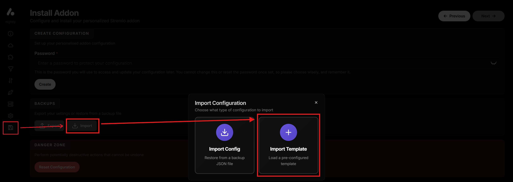
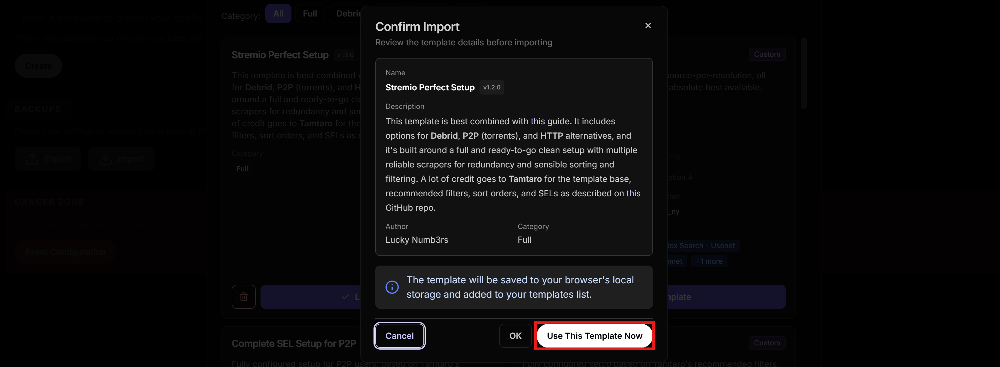
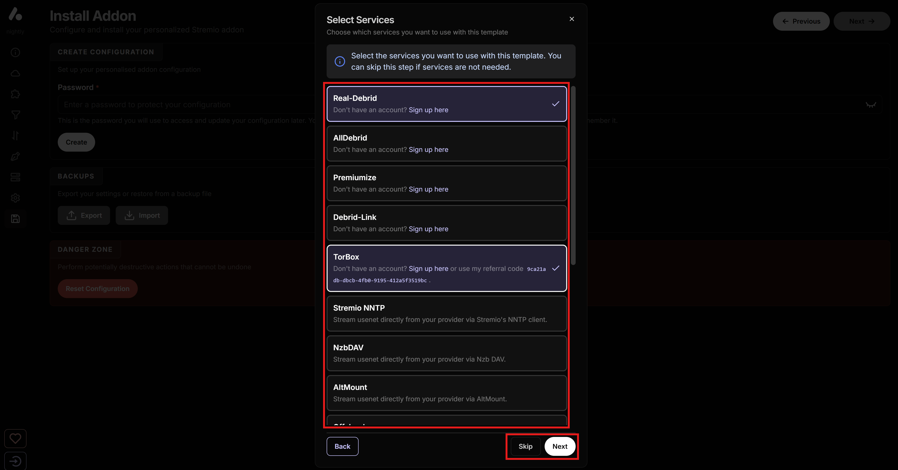
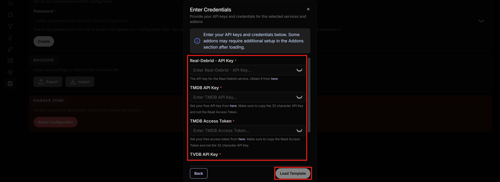
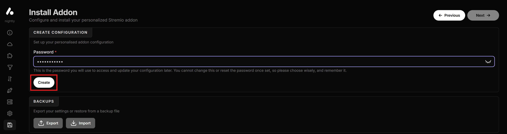
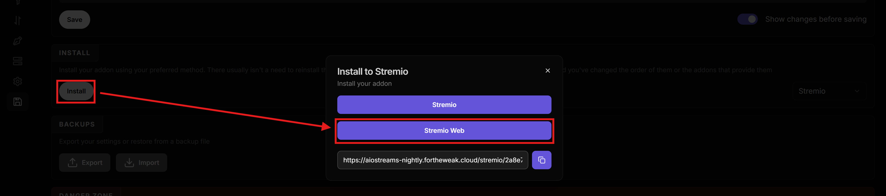

# 📚 3. AIOStreams [Find Stream Sources for Movies/Shows]

AIOStreams is the stream aggregation engine in this setup. It combines multiple scraping sources into one consistent results list, and lets you apply filtering, sorting, and formatting so the best links appear first.

Select an **AIOStreams** instance from [**this**](https://status.dinsden.top/status/stremio-addons) or [**this**](https://status.stremio-status.com/) link (they both show the same instances and their online status, it's just two different sources) and:

* ***WARNING**:*
   * *If you want to understand more what an instance means, go to [***🔰 Beginner Concepts***](0-Beginner-Concepts.md).*
   * *[***Midnight's***](https://aiostreamsfortheweebsstable.midnightignite.me/) or [***Yeb's***](https://aiostreams.fortheweak.cloud/) are some of the most popular, so you can use these links directly, but almost all are viable options.*
   * *If you go with **Yeb's**, **DON'T** use the old [*aiostreamsfortheweak.nhyira.dev*](https://aiostreamsfortheweak.nhyira.dev/) link, but [*aiostreams.fortheweak.cloud*](https://aiostreams.fortheweak.cloud/), as linked right above.*
   * ***DON'T** choose an instance that says **Nightly**, since they may not be stable.*
   * ***DON'T** choose the **ElfHosted** instance because Torrentio doesn't work there.*
   * *Choose one of the instances and stick with it, you will store your configuration here, and if you change to the other instance, you'll need to do it again because it's not automatically transferred*
   * *You can keep the monitoring links above for later to check the instance online status, if it happens that it's not working and might be temporarily down.*

1. Select "**Advanced**" on the welcome screen if it shows up.
2. Copy [**this**](https://raw.githubusercontent.com/luckynumb3rs/stremio-perfect-setup/refs/heads/main/templates/AIOStreams.json) link (right-click and "*Copy link address*").
3. Go to the "**Save & Install**" tab on AIOStreams (sidebar menu on the left), click "**Import**", "**Import Template**", paste the link you copied and click on "**Go**".

4. Click "**Use this Template Now**".

5. On the "**Select Services**" page that is shown, enable the Debrid services you want to use (or click "*Skip*" if you don't use any), and click "**Next**".

6. On the "**Enter Credentials**" page, enter all API keys you prepared earlier.
   * For **RPDB**, unless you have an account and a paid subscription with your own API key, you can also use the free standard API Key "*t0-free-rpdb*" directly.
7. Click on "**Load Template**".

8. **Optional**: At this point AIOStreams is ready, but you can keep configuring it however you like. For example, if you want to further configure the scrapers or subtitle languages, you can go to the "**Installed Addons**" tab, where you will see:
   * *You can configure each of them with the Pencil button on the right if needed.*
   1. **Torrentio, StremThru, Comet, MediaFusion, Jackettio** are the scrapers finding the sources.
   2. **SeaDex and AnimeTosho** are for Anime and initially disabled. **If you want Anime results** you need to enable these.
   3. **SubHero** is for the subtitles, you can edit the languages and any other subtitle preferences here.

   * *If you want to have a language other than English to show first on the results list, go to* ***Filters*** *tab, then* ***Language***, *and add your language to the* ***Preferred Languages*** *list, and put it first in the* ***Preference Order*** *list (shown in the picture with German language as an example). You can also add the language in the ***Required Languages*** to ONLY show streams in that language, but keep in mind that streams that might have no language tags at all or tagged as "multi" will not be shown.*

   * *If you want to take it a step further and totally prioritize your language, even before Quality and Resolution, then go to the* ***Sorting*** *tab, select* ***Cached*** *on the* ***Sort Order Type*** *dropdown menu, and on the* ***Order*** *section, move* ***Language*** *to the top or wherever you want to have it. Do this also for the* ***Uncached*** *sort order type.*

9. Go to the "**Save & Install**" tab, enter a password on the "**Create Configuration**" section, and click "**Create**".
   * **ALWAYS SAVE IN THIS TAB EVERY TIME YOU MAKE CHANGES LATER.**
   * *Copy and store the* ***UUID*** *that is shown and the* ***Password*** *you set for later to access the configuration again. This is basically your AIOStreams account.*
   * *If you can't save the configuration with the error "Jackettio requires a debrid service", which happens in case you are not using any debrids, then just uninstall Jackettio from the "Installed Addons" tab.*
   * *If you can't save the configuration with errors like "Jackettio/SeaDex/AnimeTosho requires a debrid service...", which happens in case you are not using any debrids, then just disable Jackettio, SeaDex, and AnimeTosho from the "Installed Addons" tab. If you watch Anime, the other scrapers might still find results, but SeaDex and AnimeTosho increase the chances. You do need a debrid service to use them though.*

10. Click "**Install**" and install the add-on on Stremio.

* ***NOTE FOR LATER:***
   * *If you see that you are getting results too slowly, try changing the fetching strategy. Go to* ***Addons***, *scroll down to* ***Addon Fetching Strategy***. *and select* ***Dynamic***. *There should already be an exit condition pre-filled, which you can leave as is, and save the configuration. However, keep in mind that this might leave out relevant results, so try it yourself. On the other hand, if you feel you're not getting enough good results, do the opposite and select* ***Default*** *instead.*

   * *If you prefer results for a language other than English, and you are not happy with the results you're getting, try disabling matching. Go to* ***Filters***, *then* ***Matching***, *and switch off the* ***Enable*** *toggle in all three sections (Title Matching, Year Matching, Season/Episode Matching).*

