# 📚 3. AIOStreams [Find Streams]

**AIOStreams** is the stream aggregation engine in this setup. It combines multiple scraping sources into one consistent results list, and lets you apply filtering, sorting, and formatting so the best links appear first.

Select an **AIOStreams** instance from [**this**](https://status.stremio-status.com/) or [**this**](https://status.dinsden.top/status/stremio-addons) link (they both show the same instances and their online status, it's just two different sources) and:

* ***WARNING**:*
   * *If you want to understand more what an instance means, go to [**🔰 Beginner Concepts**](0-Beginner-Concepts.md#what-does-an-addon-instance-mean).*
   * *[**Midnight's**](https://aiostreamsfortheweebsstable.midnightignite.me/) or [**Yeb's**](https://aiostreams.fortheweak.cloud/) are some of the most popular, so you can open these links directly, but almost all are viable options.*
   * *If you go with **Yeb's**, **DON'T** use the old [aiostreamsfortheweak.nhyira.dev](https://aiostreamsfortheweak.nhyira.dev/) link, but [aiostreams.fortheweak.cloud](https://aiostreams.fortheweak.cloud/), as linked right above.*
   * ***DON'T** choose an instance that says **Nightly**, since they may not be stable.*
   * ***DON'T** choose the **ElfHosted** instance because Torrentio doesn't work there.*
   * *Choose one of the instances and stick with it, you will store your configuration here, and if you change to the other instance, you'll need to do it again because it's not automatically transferred*
   * *You can keep the monitoring links above for later to check the instance online status, if it happens that it's not working and might be temporarily down.*

1. Select "**Advanced**" on the welcome screen if it shows up.
2. Copy [**this**](https://raw.githubusercontent.com/luckynumb3rs/stremio-perfect-setup/refs/heads/main/templates/AIOStreams.json) link (right-click and "*Copy link address*").
3. Go to the "**Save & Install**" tab on AIOStreams (sidebar menu on the left), click "**Import**", "**Import Template**", paste the link you copied and click on "**Go**".

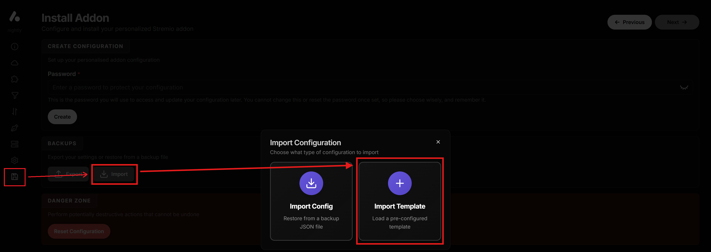

4. Click "**Use this Template Now**".

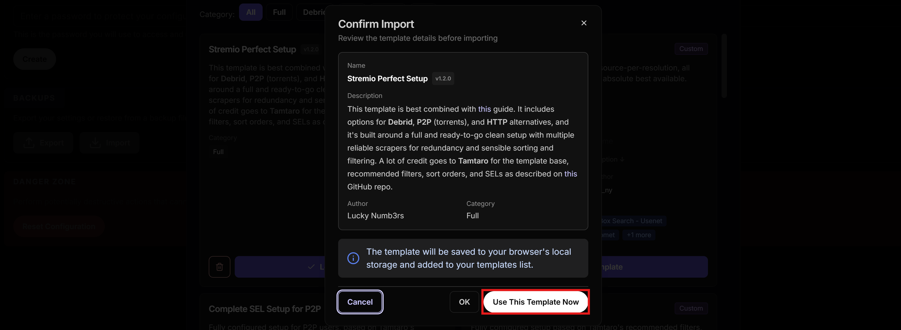

5. On the "**Select Services**" page that is shown, enable the Debrid services you want to use (or click "*Skip*" if you don't use any), and click "**Next**".

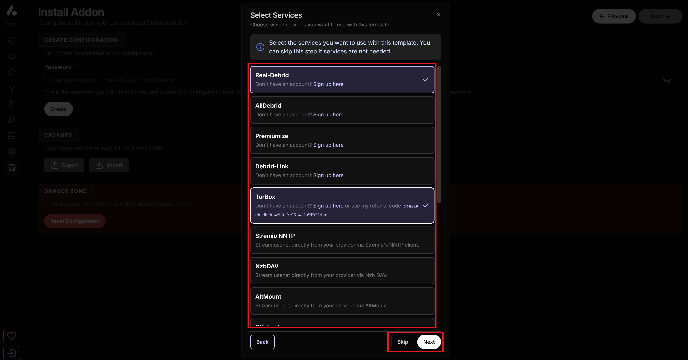

6. On the "**Template Options**" page, you'll be able to personalize the configuration to match your preferences:
   * **Preferred Languages**: Here you can select your preferred stream languages that you want to be sorted first when the streaming options are shown. *Original, Dual Audio, Multi, Dubbed, and Unknown* are automatically appended after your selections.
   * **Preferred Subtitles**: Here you can select the subtitles that should be loaded when opening a stream.
   * **Formatter Style**: Here you can choose the formatting of the stream information view.
      * ***Flat Monochrome Icons*** has a cleaner look based on minimalistic white icons.
      * ***Colorful Icons*** contains a colored version with more graphical icons.
      * ***None*** retains your existing formatter (no changes will be made to the formatter, but other filters and settings will still be imported).
   * **Anime Addons** (not available in P2P): If enabled, anime-specific addons (SeaDex, AnimeTosho) will be added to the addon list.
   * **Debridio** (not available in P2P): If enabled, [Debridio](https://debridio.com) will be added. You will need your *Debridio API key* from your account settings.
   * **HTTP Addons**: If enabled, addons for HTTP streams will included. Good backup options for niche/older titles, or if you don't/can't use debrid and/or torrents. HTTP Addons are auto-included in the P2P setup (if you didn't enable a debrid service).
   * **Global Timeout**: Enter the time in ms that you're willing to wait for results before your scraper addons timeout. You can set it a bit higher if you have issues getting enough results or you want to make sure to get as many results as possible.

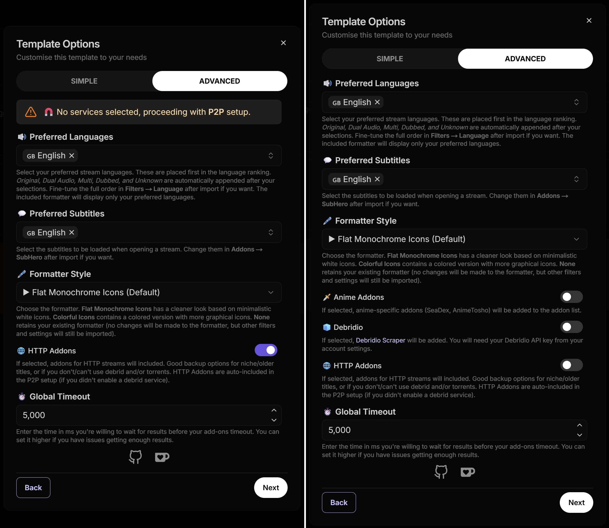

7. On the "**Enter Credentials**" page, enter all API keys you prepared earlier.
   * For **RPDB**, unless you have an account and a paid subscription with your own API key, you can also use the free standard API Key "*t0-free-rpdb*" directly.
8. Click on "**Load Template**".

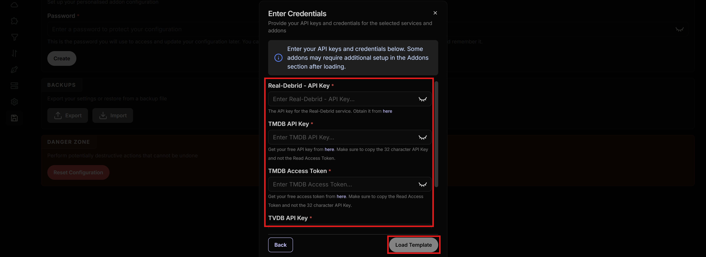

9. **Optional**: At this point AIOStreams is ready, but you can keep configuring it however you like. For example, if you want to further configure the scrapers or subtitle languages, you can go to the "**Installed Addons**" tab.
   * *You can configure each of them with the Pencil button on the right if needed.*
   * Depending on what you selected during the template options (whether you used a debrid service, P2P directly, or can't use either), different addons got installed for you. Here's a summary:
      1. **TorBox, Torrentio, Meteor, Comet, StremThru, MediaFusion, Knaben, Sootio** are the ***main scrapers*** finding the sources.
      2. **TorrentsDB** and **Peerflix** are ***additional scrapers*** installed when using the *P2P-only* setup.
      3. **SeaDex and AnimeTosho** are ***for Anime*** and are available only when using a debrid service.
      4. **Nuvio Streams**, **WebStreamr**, and **Sootio** (again) are ***HTTP scrapers*** that provide direct web streams. You can use these ***if you don't/can't use debrid and/or torrents***. They may be more limited in quality and availability, but are a good alternative. You can also disable them if you use a debrid, you don't normally need them.
      5. **Debridio** and **Watchtower** are additional scrapers for those of you who use the ***Debridio*** service.
      6. **Library** is an addon that can search through your own debrid library (if you e.g. download something manually in debrid).
      7. **SubHero** is ***for the subtitles***, you can edit the languages and any other subtitle preferences here.

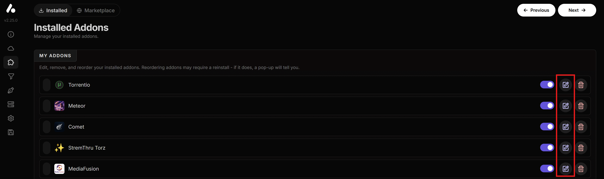

   * *If you want to fine-tune how languages shound show on the results list, go to **Filters** tab, then **Language**, and add/remove your languages to the **Preferred Languages** list, and arrange them in the **Preference Order** list (shown in the picture with German language as an example). You can also add the languages in the **Required Languages** if you want to ONLY show streams in that language, but keep in mind that streams that might have no language tags at all or tagged as "multi" will be filtered out.*

   * *If you want to take it a step further and totally prioritize your language, even before Quality and Resolution, then go to the **Sorting** tab, select **Cached** on the **Sort Order Type** dropdown menu, and on the **Order** section, move **Language** to the top or wherever you want to have it. Do this also for the **Uncached** sort order type.*

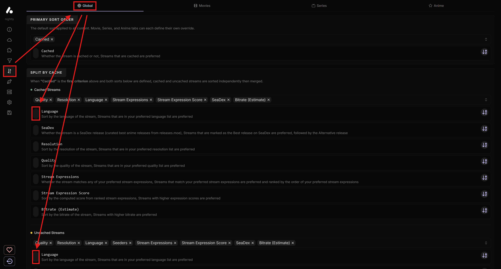

10. Go to the "**Save & Install**" tab, enter a password on the "**Create Configuration**" section, and click "**Create**".
   * **ALWAYS SAVE IN THIS TAB EVERY TIME YOU MAKE CHANGES LATER.**
   * *Copy and store the **UUID** that is shown and the **Password** you set for later to access the configuration again. This is basically your AIOStreams account.*

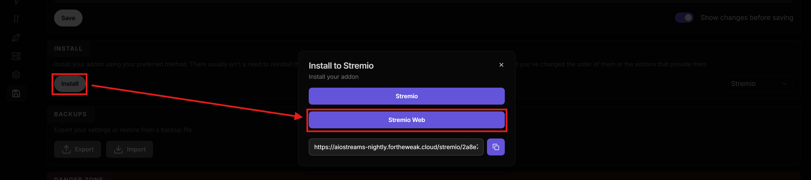

11. Click "**Install**" and install the add-on on Stremio.

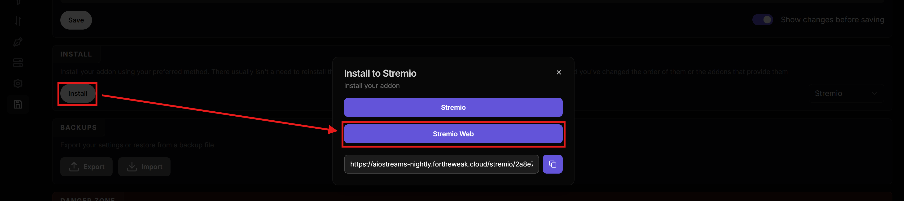

* ***NOTE FOR LATER:***
   * *If you see that you are getting results too slowly, try changing the fetching strategy. Go to **Addons**, scroll down to **Addon Fetching Strategy**. and select **Dynamic**. There should already be an exit condition pre-filled, which you can leave as is, and save the configuration. However, keep in mind that this might leave out relevant results, so try it yourself. On the other hand, if you feel you're not getting enough good results, do the opposite and select **Default** instead.*

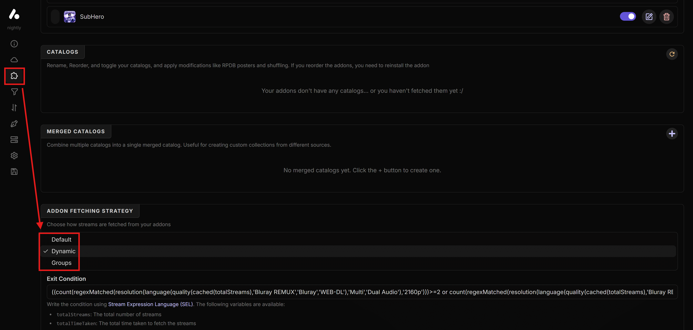

   * *If you prefer results for a language other than English, and you are not happy with the results you're getting, try disabling matching. Go to **Filters**, then **Matching**, and switch off the **Enable** toggle in all three sections (Title Matching, Year Matching, Season/Episode Matching).*

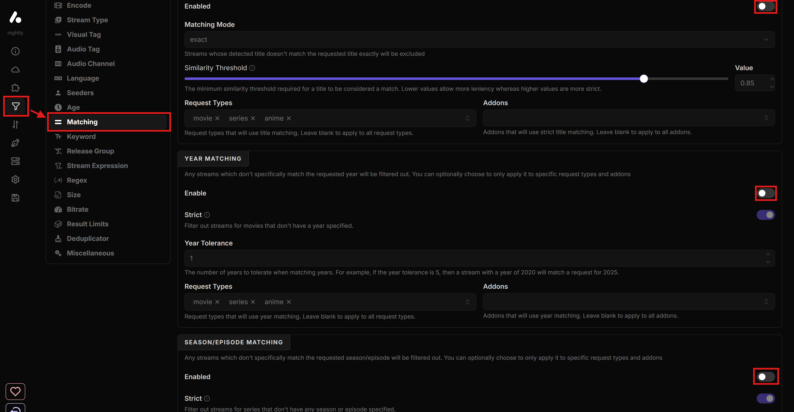

