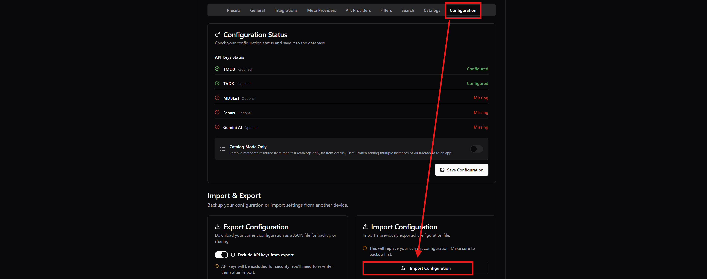
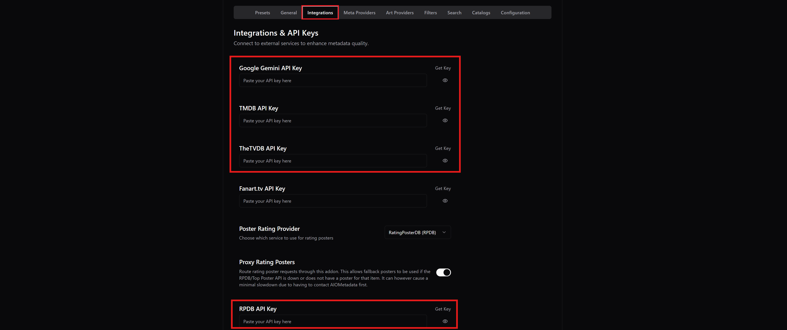
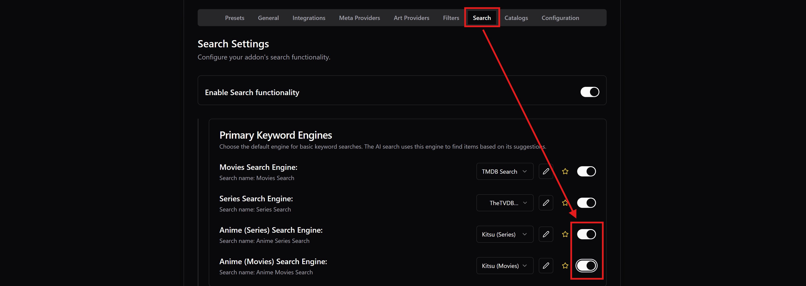
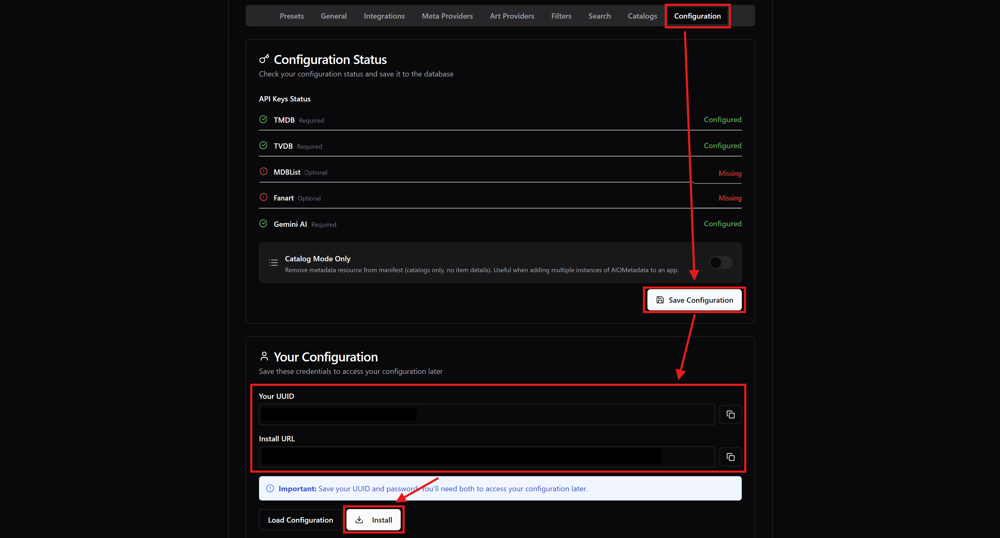
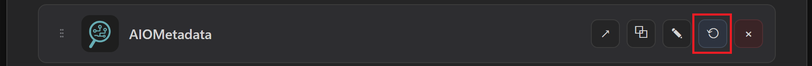

# 🔎 4. AIOMetadata [Explore, Browse, and Search Movies/Shows]
----------------------------------

Select an **AIOMetdata** instance from [**this**](https://status.dinsden.top/status/stremio-addons) or [**this**](https://status.stremio-status.com/) link (they both show the same instances and their online status, it's just two different sources) and:

* ***WARNING**:*
   * *If you want to understand more what an instance means, go to [***Beginner Concepts***](0-Beginner-Concepts.md).*
   * *[***Viren's***](https://aiometadata.viren070.me/) or [***Midnight's***](https://aiometadatafortheweebs.midnightignite.me/) are some of the most popular, so you can use these links directly, but almost all are viable options.*
   * ***Yeb's** and **Kuu's** are not working with Trakt currently because Trakt has imposed strict rate limits lately, so don't use these instances for now.*
   * *Choose one of the instances and stick with it, you will store your configuration here, and if you change to the other instance, you'll need to configure it again because it's not automatically transferred.*
   * *You can keep the monitoring links above for later to check the instance online status, if it happens that it's not working and might be temporarily down.*

1. Download my configuration file [**here**](https://raw.githubusercontent.com/luckynumb3rs/stremio-perfect-setup/refs/heads/main/templates/AIOMetadata.json) (right-click, "*Save As*", and save it as `.json`, not `.txt`).
2. Go to the "**Configuration**" tab, click on "**Import Configuration**", and load my configuration file.

3. Go to the "**Integrations**" tab, and enter the API keys for Gemini, TMDB, TheTVDB, RPDB.
   * For **RPDB**, unless you have an account and a paid subscription with your own API key, you can also use the free standard API Key "*t0-free-rpdb*" directly.

4. Go to the "**Catalogs**" tab, and near the "Quick Add" button, you will see the **Trakt** icon. Click on it and follow the steps to connect your Trakt account.

   * ***NOTE**: If you encounter any issues with Trakt integration on AIOMetadata, it's probably because Trakt is rate limiting the instance you're using, or the instance provider has disabled it (if it says "Instance owner has not yet set up the Trakt integration."). In that case, try to do the AIOMetadata setup with another instance. Alternatively, you can leave Trakt integration disabled, and hide the Trakt catalogs on the list (marked with a red **Trakt** tag on the right) by clicking the green eye icon for each. I know it's not ideal since you created a Trakt account already, but there's nothing we can do about it. You can still add other catalogs from the other sources there, but it's outside the scope of this guide.*

   * *If you want some ready-to-use and well-maintained lists, while on the Trakt tab, search for the lists from user "snoak", and you will be able to import a lot of interesting lists. I have already included some of them in the catalog, but you can add more.*
   * **For Anime users**: *If you want to enable search for Anime, make sure to go to to the "Search" tab and enable both "Anime Search Engine" switches.*

   * **For other languages**: *If you want the metadata (descriptions, titles, etc.) to show in a different language than English, go to the "General" tab and change the "Display Language".*

5. **Optional**: At this point AIOMetadata is ready, but you can keep configuring it however you like, but otherwise the configuration I provided is ready to be used. On the "**Catalogs**" tab you can add, remove, enable, disable catalogs depending on your preferences.
6. Go to the "**Configuration**" tab again and click on "**Save Configuration**".
   * **ALWAYS SAVE IN THIS TAB EVERY TIME YOU MAKE CHANGES LATER.**
   * *Copy and store the* ***UUID*** *that is shown and the* ***Password*** *you set for later to access the configuration again. This is basically your AIOMetadata account.*
7. Click "**Install**" and install the add-on on Stremio.
   * *If you get a "AddonsPushedToAPI Max descriptor size reached" error when installing, you probably have too many catalogs on AIOMetadata. Disable some, save the configuration, and try to install it again.*

* ***NOTE FOR LATER:***
   * *Keep in mind that if you want to change catalogs after you have installed AIOMetadata on Stremio, you need to refresh the installation, otherwise the catalogs with not show. You do that with Cinebye below.*

----------------------------------

[← Previous [AIOStreams Setup]](3-AIOStreams-Setup.md)  |  [Next [Cinebye Cleanup] →](5-Cinebye-Cleanup.md)
