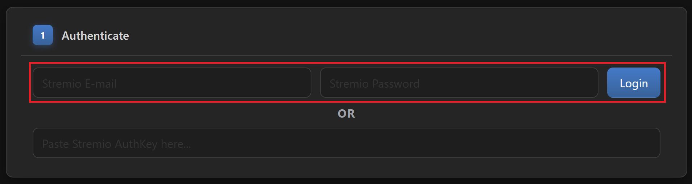
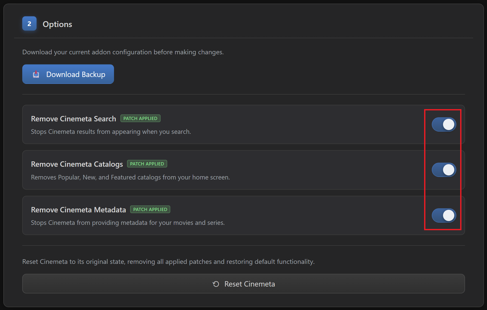
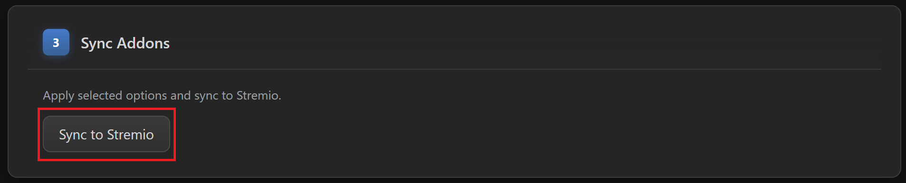

# 🧹 5. Cinebye [Clean-Up]
----------------------------------

Go to this [**Cinebye**](https://cinebye.elfhosted.com/) instance and:

1. Sign in with your Stremio account details.
   1. OR if you don't want to use your credentials directly, there is a more complicated approach:
   2. Login to [**Stremio Web**](https://web.stremio.com/) using your credentials in your browser.
   3. Open the developer console (F12 on Chrome) and paste this code snippet: `JSON.parse(localStorage.getItem("profile")).auth.key`
   4. Take the output value and paste it in Cinebye where it says "*Paste Stremio AuthKey here...*".
   5. Press **Enter** or click **Login**.

2. Once authenticated and the options become available, in section "**2 - Options**" you can download a backup first just to be safe.
3. Enable all three patches: "**Remove Cinemeta Search**", "**Remove Cinemeta Catalogs**", and "**Remove Cinemeta Metadata**".

4. Scroll down to "**Manage Addons**" and change the order of the add-ons to this:
   1. *Cinemeta*
   2. *AIOMetadata*
   3. *AIOStreams*
   4. *Local Files*

5. Scroll back up to "**3 - Sync Addons**" and click on "**Sync to Stremio**".

* ***Note:*** *Keep in mind for later that if you change catalog structure in AIOMetadata after you installed it on Stremio, or if you add the CouchMoney lists from Step 6 below, then come back to Cinebye, authenticate again with Stremio credentials, and click the* ***Refresh*** *icon to the right of AIOMetadata in the* ***"Manage Addons"*** *section.*

----------------------------------

[← Previous [AIOMetadata Setup]](4-AIOMetadata-Setup.md)  |  [Next [Personalized Lists] →](6-Personalized-Lists.md)