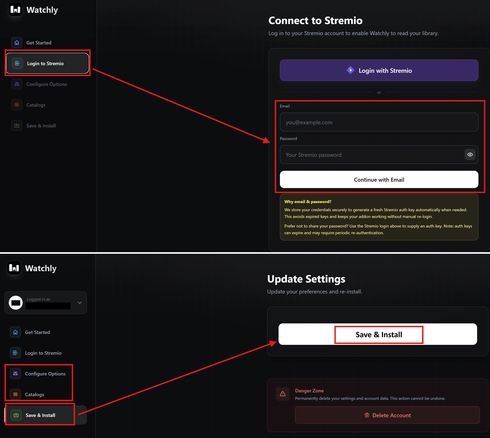
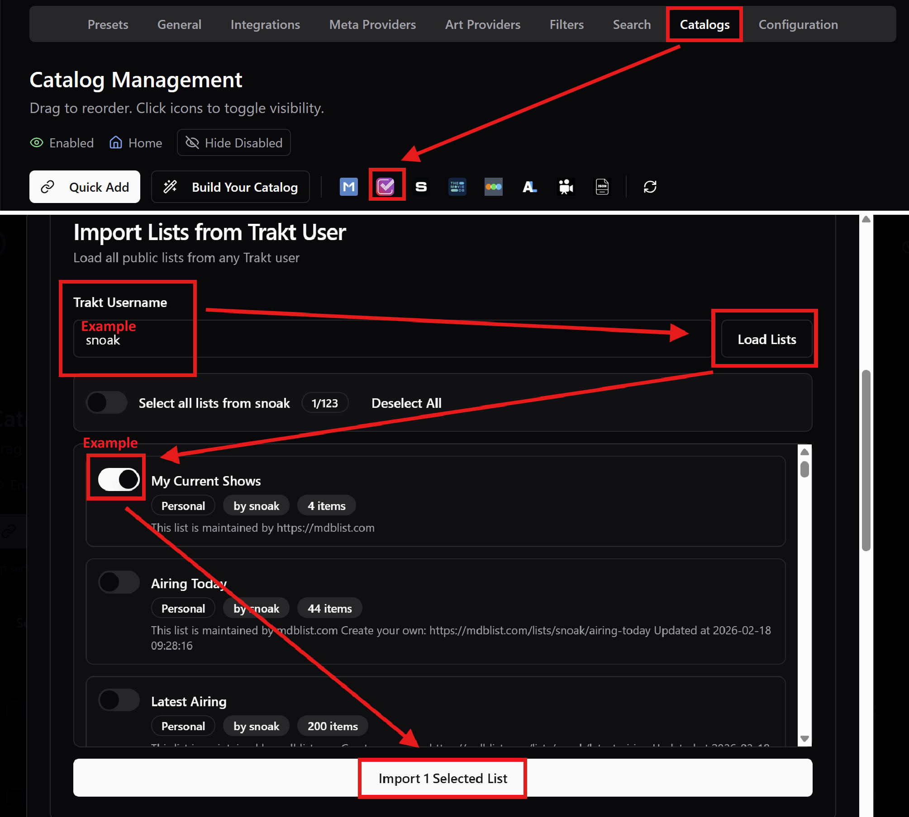

# 🤖 6. Personalized & Automated Lists
----------------------------------

At this point you are done, YAY!, so you can start enjoying it already OR you can do one more step if you want proper custom lists that are specifically made for you (like Netflix suggestions). There are two approaches for this:

1. **CouchMoney** creates personalized Trakt lists, which is a good basic setup, but since Trakt allows only 2 lists for free users, it might be limiting for some.
2. **Watchly** on the other hand is a full-blown recommendations addon that provides real Netflix-like suggestions, and multiple dynamic catalogs depending on what you watch and like. I would recommend this more if you want extensive suggestions, but these catalogs are only on Stremio, they are not Trakt lists, so in case you need the lists for some purpose outside Stremio, you can't.

So you can decide which you want to use (or both!) and here are the steps for each:

* **Watchly**:
   1. Go to [**this**](https://watchly.elfhosted.com/) **Watchly** instance.
   2. Click on "**Get Started**".
   3. Login with your Stremio account email and password (recommended), OR click on "**Login with Stremio**", sign in to your Stremio account, and click "**Accept**" to allow Watchly to connect to your account (the second approach may expire in the future and you may need to log in again).
   4. You will then land on the Watchly "**Preferences**" page. Configure according to your personal preferences here.
   5. In the "**Poster Rating Provider**" section, select RPDB, and enter "*t0-free-rpdb*" in the API key field.
   6. Click on "**Next: Catalogs**" and configure catalogs here also according to your personal preferences.
   7. Click on "**Next: Install**" and click on "**Save & Install**".
   8. Click "**Install on Web**" and install the add-on on Stremio.
   * ***Notes:***
      * *If you want these Watchly catalogs to show on top (which you'll probably want), go to Cinebye again and change the order of the addons by putting Watchly second, after Cinemeta and before AIOMetadata.*
      * *If your Stremio account is new, it will not have a watch history yet, so you may get "Failed to fetch" or similar issues on the Watchly catalogs when showing on Stremio. Don't worry, they should show up properly once it has enough information to personalize your lists.*

* **CouchMoney**:
   1. Go to [**CouchMoney**](https://couchmoney.tv/) and click "**Login with Trakt**".
   2. Follow the steps to connect your Trakt account.
   3. CouchMoney will create two lists for you based on your Trakt watch history and ratings, which you can customize further if you want on this page.
   4. Go to your AIOMetadata account and sign in if needed (top right there's a sign in button) with your AIOMetadata credentials.
   5. Go to the "**Catalogs**" tab and click on the Trakt icon.
   6. You should already be connected to your Trakt account here, so scroll down to the "**Import Lists from Trakt User**" section.
   7. Search for your Trakt username (which you can set/check in your Trakt account settings).
   8. The lists created by CouchMoney should show up here.
   9. Add them to your Catalog and order them as you wish.
   * ***Note:*** *As mentioned above, when you change catalog structure in AIOMetadata, go back to Cinebye, authenticate again with Stremio credentials, and click the* ***Refresh*** *icon to the right of AIOMetadata in the* ***Manage Addons*** *section.*

And now you're really done! Check out the Q&A if you want to tweak it further.

----------------------------------

[← Previous [🧹 Cinebye Cleanup]](5-Cinebye-Cleanup.md)  |  [[🛠️ Additional Stuff] Optional →](7-Additional-Stuff.md)