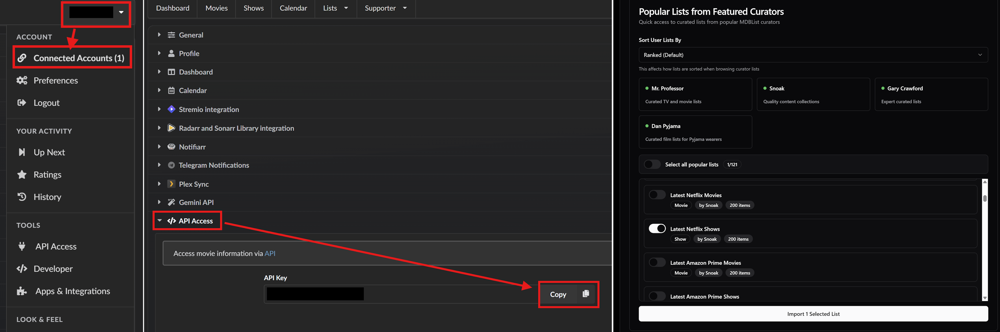
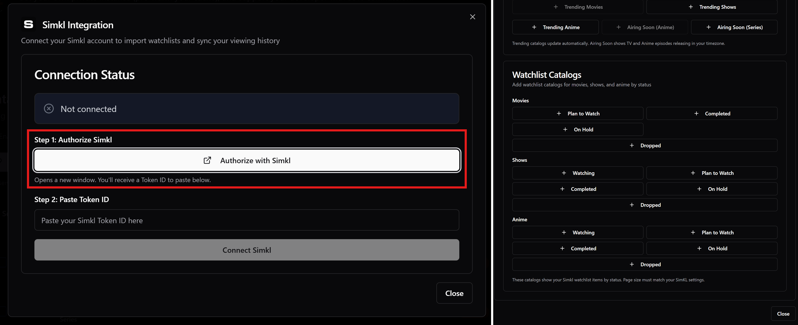

# 🛠️ Additional Stuff
----------------------------------

Most of the tips to address some issues are already included in-between the steps of the guide, but I am adding this section for any additional tweaks, explanations, or alternative configurations:

## Quick Navigation

- [Smart Stream Selection & Sorting](#smart-stream-selection--sorting)
- [Alternative Color Stream Information](#alternative-color-stream-information)
- [Understanding Stream Information View](#understanding-stream-information-view)
- [Enriching Your Catalogs (Trakt Alternatives)](#enriching-your-catalogs-trakt-alternatives)

----------------------------------

## Smart Stream Selection & Sorting

The **AIOStreams** template you used from this guide includes multiple optimizations highly recommended by the Stremio community to intelligently filter, score, and prioritize streams for a cleaner, easier, and more reliable viewing experience.

* The template includes a best practice filtering system called [**TamTaro's SELs**](https://github.com/Tam-Taro/SEL-Filtering-and-Sorting). This system intelligently scores available streams based on multiple quality factors such as resolution, reliability, cache status, release details, and more. It does not just sort the list, it actively filters out weaker results and surfaces only the strongest candidates. The result is a cleaner, more curated selection of streams, helping you avoid decision fatigue and quickly choose a high quality option with confidence.

* The template also integrates trusted pattern rules like [**Vidhin's Regexes**](https://github.com/Vidhin05/Releases-Regex), which analyze stream titles and detect important indicators such as reputable release groups, quality tags, and encoding formats. By accurately identifying these details, the system can better label, prioritize, or exclude certain streams. In simple terms, regex helps the system understand what each stream actually is before any scoring takes place.

* **Together**, these two systems work hand in hand. Regex identifies meaningful quality signals inside stream names, and SEL uses those signals, along with other factors, to score, filter, and rank the results. The combination creates a smarter, cleaner, and more reliable stream selection experience.

* **However**, if you are not satisfied with the results because you want more to choose from, or you feel they are malfunctioning somehow, you can remove them all by going to **Filters** in **AIOStreams**, then both in **Stream Expression** and **Regex** respectively, and delete all entries configured there (with the red *trash can* button to the right).

* Finally, the **Sorting** in the template is configured to show the streams in the following order:

   * *Cached/Uncached (if applicable)*
   * *SeaDex (only for Anime)*
   * *Resolution*
   * *Quality*
   * *Stream Expressions*
   * *Stream Expressions Score*
   * *Seeders (if Uncached)*
   * *Language*
   * *Bitrate*

* **However**, if you want to change the **Sorting** order, in **AIOStreams** go to **Sorting**, select **Cached** or **Uncached** from **Sort Order Type** and change the order.

----------------------------------

## Alternative Color Stream Information

If you want a more colorful version of the stream information view than the one included, you can go to the **Formatter** tab in **AIOStreams**, and replace the text in the **Description Template** with this:

```
{stream.edition::exists["🎬  {stream.edition} "||""]}
{stream.encode::exists["🎞️  {stream.encode}  "||""]}{stream.visualTags::exists["🎥  {stream.visualTags::join(' · ')}  "||""]}
{stream.audioTags::exists["🎵  {stream.audioTags::join(' · ')}  "||""]}{stream.audioChannels::exists["🎧  {stream.audioChannels::join(' · ')} "||""]}
{stream.size::>0::and::stream.seasonPack::istrue["📦  "||""]}{stream.size::>0::and::stream.seasonPack::isfalse["📦  "||""]}{stream.size::>0["{stream.size::sbytes}"||""]}{stream.bitrate::exists[" · {stream.bitrate::sbitrate::replace('Mbps','ᴹᵇᵖˢ')::replace('Kbps','ᴷᵇᵖˢ')}  "||""]}{stream.message::~Download["{tools.removeLine}"||""]}{stream.age::exists["🕒 {stream.age}"||""]}
{stream.proxied::istrue["🛠️ "||"🛠️ "]}{service.shortName::exists["[{service.shortName}] "||""]}{addon.name}{stream.type::replace('debrid',' ')::exists[" · {stream.type::replace('debrid',' ')::smallcaps}"||""]}{service.cached::isfalse::or::stream.type::=p2p::and::stream.seeders::>0["  ⇋ {stream.seeders}🌱  "||""]}
{stream.languages::exists["🔊  {stream.languageEmojis::join(' · ')::replace('ᴅᴜᴀʟ ᴀᴜᴅɪᴏ','ᴅᴜᴀʟ')::replace('ᴅᴜʙʙᴇᴅ','ᴅᴜʙ')}  "||""]}{stream.seadex["»  "||""]}{stream.seadexBest::istrue["[ʙᴇsᴛ] "||""]}{stream.seadex::istrue::and::stream.seadexBest::isfalse["[ᴀʟᴛ ʙᴇsᴛ] "||""]}
```

----------------------------------

## Understanding Stream Information View

The formatting templates are designed to let you evaluate a stream easily before opening it. If you want to understand what all the icons on the stream information mean, here is how to read them:

**Main Line**
* ⚡ / ⏳ → [Debrid] Cached (instant playback) / Not Cached (may take longer)
* 🧲 / 🌐 / 📺 → Torrent (P2P) / Direct HTTP / Live Stream
* **UHD ⁴ᴷ / QHD ²ᴷ / FHD / 720P** → Resolution
* ⌜**QUALITY**⌟ → Source Quality (Remux, WEB, BluRay, etc.)
* ◆◆⬖◇◇ → Release Quality Score (based on [**Vidhin's Ranked Regexes**](https://github.com/Vidhin05/Releases-Regex), sorted after *Quality & Resolution*)

**Technical Details**
* ▶︎ / 🎬 → Edition (Director’s Cut, Extended, IMAX…)
* ▣ / 🎞️ → Video Encoding (x264, x265, HEVC…)
* ✧ / 🎥 → Visual Features (HDR, Dolby Vision, 10-bit…)
* ♬ / 🎵 → Audio Format (DTS, Atmos, TrueHD…)
* ☊ / 🎧 → Audio Channels (5.1, 7.1…)

**File & Availability**
* ◧ / 📦 or ⧉ / 📦 → Single File / Season Pack
* **Size** · **Bitrateᴹᵇᵖˢ** → File Size & Density (helps estimate quality vs bandwidth needs)
* ⟳ / 🕒 → Upload Age (newer is often better seeded)

**Provider & Delivery**
* ⛊ / ⛉ / 🛠️ **[Provider] Addon** → Debrid Service (if applicable) & Scraper (proxied or unproxied)
* ⇋ **Seeders** 𖧧 / 🌱 → Number of seeders for torrents (higher = more reliable)

**Languages**
* ⚐ / 🔊 → Available Audio Languages

**Anime Curated Releases** (if applicable)
* » → SeaDex Indexed Release
* **[BEST]** → Highest-ranked release
* **[ALT BEST]** → Strong Alternative (if the best fails)

👉 **Quick Tip:**
Prioritize streams that are **⚡ cached**, high resolution, strong score (◆), and reasonably sized. This usually gives the fastest start and best quality.

----------------------------------

## Enriching Your Catalogs (Trakt Alternatives)

This guide uses **Trakt** as the default content tracker, mainly because it's also natively supported by Stremio. Through **Trakt Scrobbling** enabled in Stremio settings, Stremio sends watch history and progress to Trakt, which you then can use to create your own lists or as a personal library manager for your preferences. However, since Trakt recently has been enforcing strict rate limits, and also limiting free accounts more and more, there are alternatives that might allow you more flexibility, and also avoid any issues with Trakt errors that have been happening increasingly often.

This is totally optional, but if you're looking for Trakt alternatives, or simply looking for more choices that you can use alongside Trakt, and more curated lists to choose from, there are two other trackers that are becoming increasingly more preferred and AIOMetadata wonderfully supports: **MDBList** (especially good if you want curated catalogs from other users) and **Simkl** (similar to Trakt). Although in this case Stremio itself doesn't sync with them, AIOMetadata does. Once enabled there, when you open a stream, AIOMetadata marks it in these platforms using their *check-in* feature (meaning it marks them as started watching), and when the stream is finished, it marks it as watched. This way you get the same watch history as with Trakt (except for the specific progress inside the stream, that's not tracked). So if you want to go this route (you don't have to do both), here are the instructions:

* **MDBList**:
   1. Create an account on [**MDBList**](https://mdblist.com/) (*You can sign up with your existing Trakt account if you have one, this will allow MDBList to sync with your Trakt account too and continuously update it*).
   2. Click on your profile name on the top right, and select "**Connected Accounts**".
   3. On the **Preferences** page that will show, click on the "**API Access**" button from the menu list, and copy the **API Key** provided.
   4. Sign in to **AIOMetadata** with your **UUID** and **Password** and go to **Integrations** tab.
   5. Enter the **API Key** in the **MDBList API Key** field.
   6. In **General** tab, make sure the "**MDBList Watch Tracking**" toggle is enabled.
   7. Go to the **Catalogs** tab and click on the **MDBList** icon next to the Trakt icon.
   8. Enter the **API Key** there again.
   9. Optional, but recommended: If you want to add popular and curated catalogs from **MDBList**, you can scroll further down on this page to the "**Popular Lists from Featured Curators**" section, click on one of the users showing there (e.g. *Snoak* or *Dan Pyjama*), and their lists will load. Select the lists you are interested in, and click on "**Import Selected Lists**". *Some lists are similar to the Trakt lists already provided in the AIOMetadata configuration downloaded from this guide, specifically the **snoak** user lists (named "Latest..."), so if you add them from MDBList, disable the provided Trakt lists to avoid duplicates.*
   10. Click "**Save & Close**", arrange the newly added catalogs however you like, and don't forget to **Save** the changes by going to the **Configuration** tab.



* **Simkl**:
   1. Create an account on [**Simkl**](https://simkl.com/).
   2. You can import your **Trakt** history when asked if you want.
   3. Once your account is ready, sign in to **AIOMetadata** with your **UUID** and **Password**.
   4. In **General** tab, make sure the "**Simkl Checkin**" toggle is enabled.
   5. Go to the **Catalogs** tab and click on the **Simkl** icon next to the Trakt icon.
   6. Follow the instructions to connect your Simkl account.
   7. You can add any catalogs you want while still on the page once connected, and then click on "**Close**".
   8. Arrange the newly added catalogs however you like, and don't forget to **Save** the changes by going to the **Configuration** tab.



----------------------------------

[[❓ Configuration Q&A] Other →](8-Configuration-QA.md)