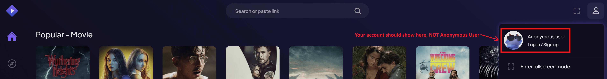
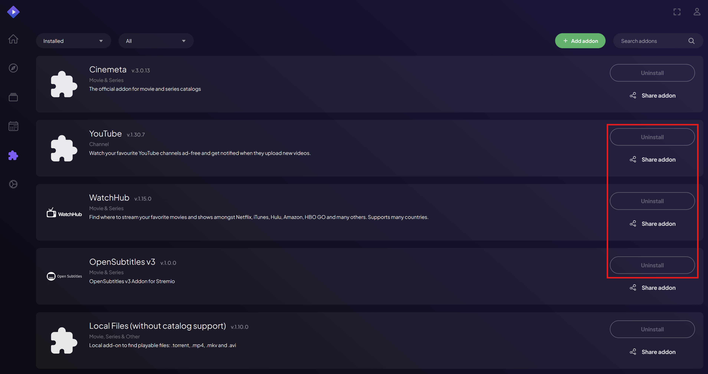
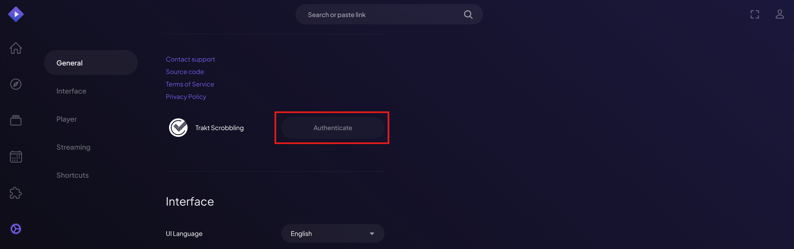
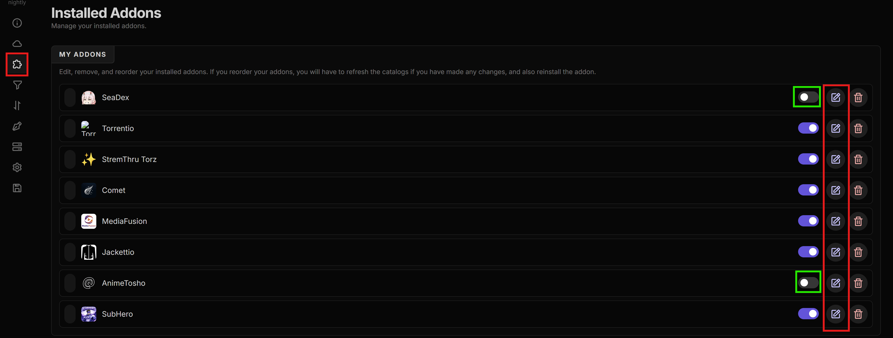
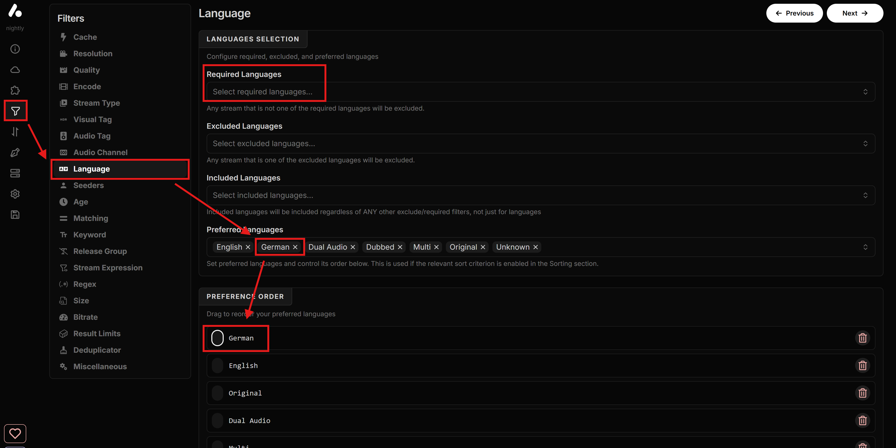
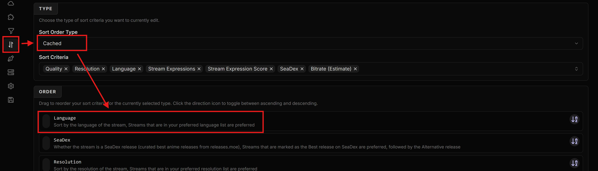
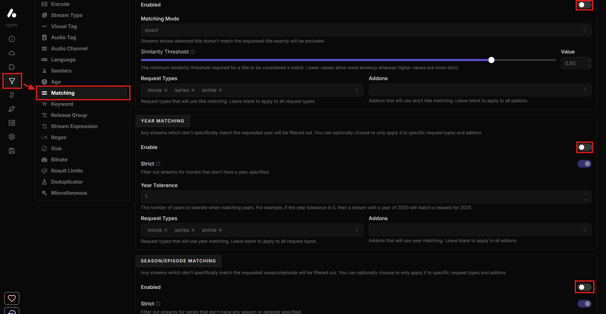
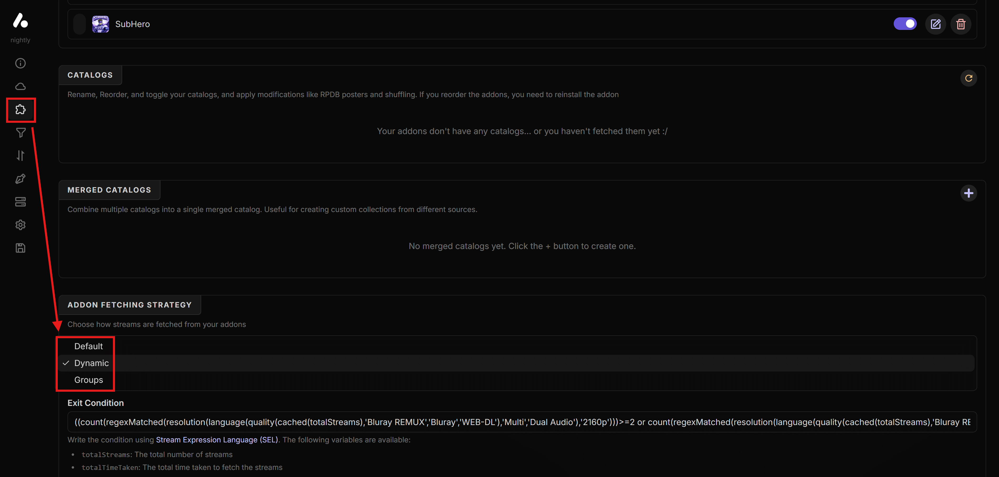
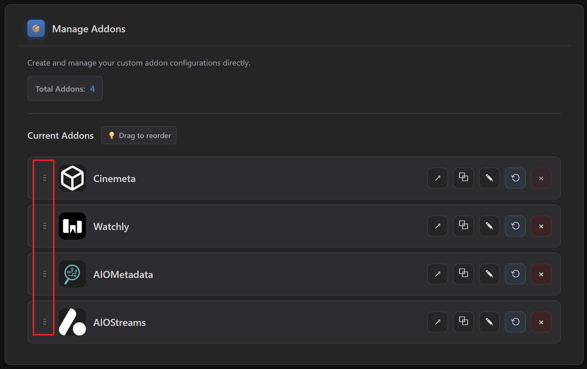

# ❓ Configuration Q&A
----------------------------------

I am including this section for anyone who has any additional questions or is encountering any common issues. Most of this is already in the guide, but a lot of you skip them :), so I have extracted them so that you can check this part out for any solutions to your questions:

* **I installed or removed addons, but nothing changes in Stremio. Am I in the wrong place?**
   * *Make sure you are signed into* [***Stremio Web***](https://web.stremio.com/) *when installing or removing addons. Being logged into* [***stremio.com***](https://www.stremio.com/) *(account site) does not automatically log you into Stremio Web.*

* **I still see old addons and clutter. How do I "reset" the account cleanly?**
   * *In* [***Stremio Web***](https://web.stremio.com/)*: go to* ***Addons*** *and uninstall everything you can.*
   * *Also remove the* ***Trakt Integration*** *addon (it is different from* ***Trakt Scrobbling***\*).\*
   * ***Cinemeta*** *and* ***Local Files*** *cannot be removed. You patch them via Cinebye.*

* **I am not using a debrid service and I want to stream via P2P torrents directly. What should I change, and what should I expect?**
   * *In* ***AIOStreams → Addons → Installed Addons***\*, disable\* ***AnimeTosho***\*,\* ***SeaDex***\*, and\* ***Jackettio*** *because they do not work without a debrid service.*
   * *You can still get anime results via the other scrapers, but they will be more limited.* ***SeaDex*** *and* ***AnimeTosho*** *usually increase the chances of finding better anime sources.*
   * *When streaming via torrents, keep in mind speeds can be slow, and some links can be unwatchable if there are not enough peers.*
   * *When torrenting, prefer links with a higher peer count (shown next to the* ***P2P*** *label).*

* **I don't understand what the icons (⚡,⏳,...) on the stream information view mean. How do I read them?**
   * *Go to [***Additional Stuff***](7-Additional-Stuff.md) to read the descriptions for each icon.*

* **The icons of the stream information view are too plain, I would like more colors to differentiate.**
   * *Go to [***Additional Stuff***](7-Additional-Stuff.md) on the extended guide to get an alternative colorful template you can use instead.*

* **I want Trakt progress syncing, but I do not want extra Trakt addons.**
   * *In* [***stremio.com***](https://www.stremio.com/) *go to* ***Settings*** *and enable* ***Trakt Scrobbling*** *by connecting your Trakt account.*
   * *Then uninstall the* ***Trakt Integration*** *addon from Stremio addons.*

* **I want Anime sources, but I am not seeing them.**
   * *In* ***AIOStreams***\*: go to\* ***Addons → Installed Addons*** *and enable* ***SeaDex*** *and* ***AnimeTosho*** *(they are disabled by default).*

   * *In* ***AIOMetadata***\*: go to\* ***Search*** *and enable both* ***Anime Search Engine*** *switches.*

* **I want subtitles in specific languages.**
   * *In* ***AIOStreams***\*: go to\* ***Addons → Installed Addons***\*, edit\* ***SubHero***\*, and set your subtitle language preferences there.\*

* **I don't understand how the streams shown to me are being sorted.**
   * *Go to [***Additional Stuff***](7-Additional-Stuff.md) to see the configured sort order.*

* **I need non-English results to appear first in the results list.**
   * *In* ***AIOStreams***\*: go to\* ***Filters → Language***\*.\*
   * *Add your language to* ***Preferred Languages***\*.\*
   * *Put it first in* ***Preference Order***\*.\*
   * *You can also add the language in the ***Required Languages*** to ONLY show streams in that language, but keep in mind that streams that might have no language tags at all or tagged as "multi" will not be shown.*

* **I want my language to be prioritized even before Quality/Resolution.**
   * *In* ***AIOStreams***\*: go to\* ***Sorting***\*.\*
      * *For* ***Sort Order Type: Cached***\*, move\* ***Language*** *to the top (or where you want it).*
      * *Repeat for* ***Sort Order Type: Uncached***\*.\*

* **I am not happy with non-English matching. It feels like good results are being filtered out.**
   * *In* ***AIOStreams***\*: go to\* ***Filters → Matching*** *and disable matching by turning off the* ***Enable*** *toggle in all three sections:*
      * *Title Matching*
      * *Year Matching*
      * *Season/Episode Matching*

* **Results are coming in too slowly. How can I speed it up?**
   * *In* ***AIOStreams***\*: go to\* ***Addons → Addon Fetching Strategy*** *and try* ***Dynamic***\*, leave the\* ***Exit Condition*** *as is, then save your config.*
   * *If you notice it misses good links, switch back to* ***Default***\*.\*

* **I feel like I am getting too few good results. What should I change?**
   * *If you set fetching to* ***Dynamic*** *(****AIOStreams → Addons → Addon Fetching Strategy****), try switching back to* ***Default***\*.\*
   * *Make sure you enabled enough scrapers (Torrentio, StremThru, Comet, MediaFusion, Jackettio are mentioned in the guide as the core scrapers).*

* **I cannot save because it says "Jackettio/SeaDex/AnimeTosho requires a debrid service…".**
   * *If you are not using debrid: disable* ***Jackettio***\*,\* ***SeaDex***\*, and\* ***AnimeTosho*** *in* ***Addons → Installed Addons***\*, then save again.\*
   * *If you want SeaDex/AnimeTosho, you will need a debrid service.*

* **I do not have an RPDB subscription. What key should I use?**
   * *Use the free RPDB key:* `t0-free-rpdb` *(works for both AIOStreams and AIOMetadata integrations as described in the guide).*

* **Titles and descriptions in Stremio are in English. Can I change the metadata language?**
   * *In* ***AIOMetadata***\*: go to\* ***General*** *and change* ***Display Language***\*.\*

* **I cannot save the AIOStreams configuration and see “Failed to fetch manifest...”.**
   * *This usually means one or more addons are temporarily offline.*
   * *Go to **Addons → Installed Addons**, disable the problematic addon, and save the configuration so you can continue the guide.*
   * *Later, return to AIOStreams, enable the addon again, and try to save it if it's back online.*

* **Some catalogs show “Failed to fetch” or appear empty in Stremio.**
   * *This is often caused by Trakt being temporarily down or rate limiting requests.
   * *Just wait it out, it will work later. No reconfiguration is needed in most cases*.

* **I added or changed AIOMetadata catalogs, but they do not show in Stremio.**
   * *Go to* ***Cinebye***\*, authenticate, and then in\* ***Manage Addons*** *click the* ***Refresh*** *icon next to* ***AIOMetadata***\*.\*

* **I get an error installing AIOMetadata: "AddonsPushedToAPI Max descriptor size reached".**
   * *You likely have too many catalogs enabled.*
   * *Disable some catalogs in AIOMetadata,* ***Save Configuration***\*, then try\* ***Install*** *again.*

* **I want Watchly recommendations to show near the top of Stremio.**
   * *Go to* ***Cinebye***\*, authenticate, and then in\* ***Manage Addons*** *reorder addons so* ***Watchly*** *is* ***second*** *(after Cinemeta, before AIOMetadata), then click* ***Sync to Stremio***\*.\*

* **I want more ready-made Trakt lists inside AIOMetadata.**
   * *In* ***AIOMetadata → Catalogs***\*, click the\* ***Trakt*** *button and search for lists from user* ***snoak*** *to import more lists.*

* **CouchMoney only created two lists for me. Is that normal?**
   * *Yes, the guide notes Trakt free users are limited (CouchMoney will create two lists). If you want more extensive recommendations inside Stremio, use* ***Watchly***\*.\*

* **I want a more "colorful" stream info layout (not the existing monochrome one).**
   * *In* ***AIOStreams → Formatter***\*, replace the\* ***Description Template*** *with the alternative template provided in the guide's "Additional Stuff" section, then save the configuration.*

* **I used the old "ForTheWeak" (fortheweak.nhyira.dev) AIOStreams/AIOMetadata domains. What do I need to do after the domain migration?**
   * ***AIOStreams:*** *redo Step 3 on one of the new instance links and use the updated template.*
   * ***AIOMetadata:*** *uninstall AIOMetadata from* ***Addons*** *in* [***web.stremio.com***](https://web.stremio.com/)*, open the new AIOMetadata instance, sign in with your existing UUID/Password (accounts were migrated automatically),* ***Save Configuration***\*,\* ***Install***\*, then go to Cinebye and reorder addons again and\* ***Sync***\*.\*

* **I forgot where to save changes in AIOStreams or AIOMetadata. What is the one rule?**
   * ***AIOStreams:*** *always save from* ***Save & Install → Save***\*.\*
   * ***AIOMetadata:*** *always save from* ***Configuration → Save Configuration***\*.\*

----------------------------------

[← Other [Additional Stuff]](7-Additional-Stuff.md)