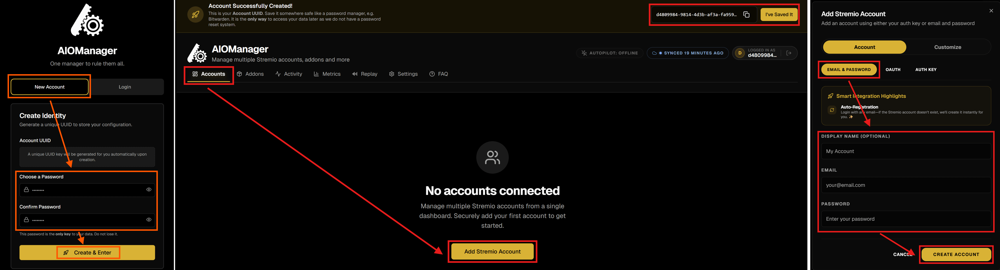
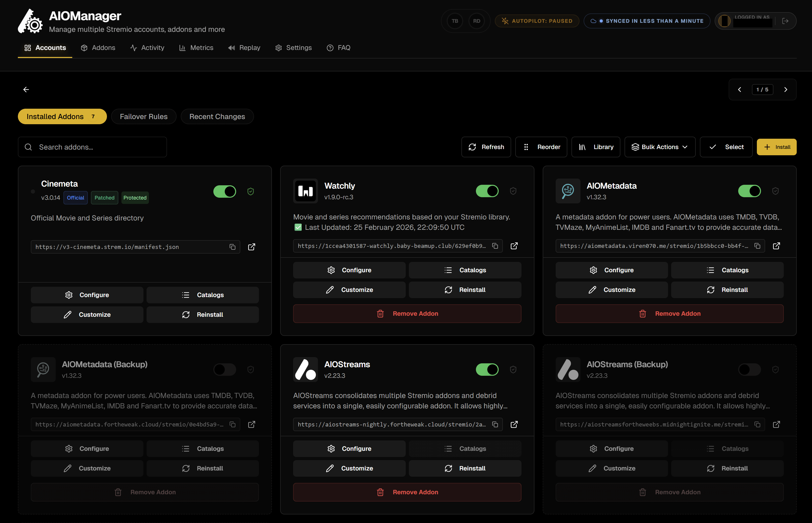
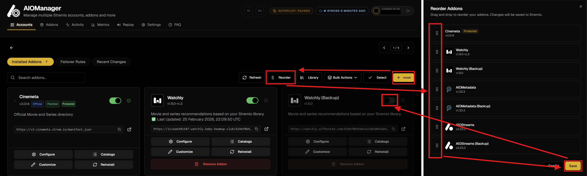
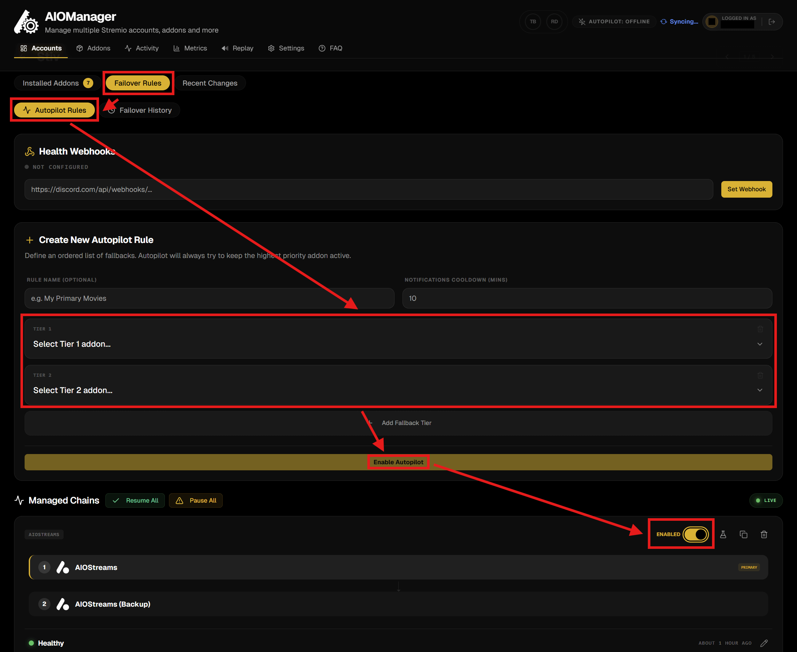

# 🎛️ AIOManager [Power Users]

**AIOManager** is fully optional and intended for power users who want to push their setup further by creating redundant, resilient configurations. If you are looking to increase reliability, add fallback layers, or manage multiple Stremio accounts in a structured way, this chapter is for you.

Let's start with what **AIOManager** can do for you:
* **Multi-Account Management**: Control and sync addons for multiple Stremio accounts from one central place.
* **Addon Backup & Redeployment**: Save complete addon configurations and redeploy them anywhere in seconds.
* **Bulk Actions & Profiles**: Install, remove, clone, or push entire addon collections across accounts with a single action.
* **Order Replication**: Copy and apply the exact same addon order to maintain a consistent interface everywhere.
* **Multiple Instances of the Same Addon**: Run parallel configurations of one addon with different settings or API keys.
* **Automatic Failover**: Switch to backup addons when a primary one goes offline to increase reliability.
* **Library Organization**: Tag and structure saved addons for faster searching and cleaner management.
* **Granular Control & Customization**: Rename, reorder, and fine-tune how addons behave in your setup.
* **Activity Visibility**: Access optional usage insights, dashboards, and fun statistics based on your watch history.

## Initial Setup

And now let's start by going to either [**this**](https://aiomanagerfortheweebs.midnightignite.me/) or [**this**](https://aiomanager.elfhosted.com/) instance and:

1. Select "**New Account**", enter a password twice (*at least 10 characters*), and click on "**Create & Enter**".
2. You will see a notification "*Account Successfully Created!*" on top of the page asking you to save your **UUID**. **Store it** somewhere safe together with the **Password** you set, and then click "**I've Saved It**".
   * *You can also go to the **Settings** tab to find your **UUID***
3. Go to the empty **Accounts** tab and click on "**Add Stremio Account**".
4. Now you can set a name for the account, and either:
   * sign in with your Stremio account by using your **Email** and **Password** (easiest & recommended),
   * connecting directly with Stremio through **OAuth**, or 
   * entering the **Auth Key** yourself (instructions are shown, or you can get it as described on the **Cinebye** page in this guide).
5. Click "**Add Account**" and the account will show up on the **Accounts** tab.
   * *You can repeat this step for all accounts you may want to manage here, if you have more than one, e.g. for all your family.*
6. Click on the account that you added.
   * *You will see the **Cinemeta** and maybe also the **Local Files** addons. If you followed this guide, they will also be ordered just like you ordered them with **Cinebye**.*

## Addon Management

AIOManager has a lot of options to manage addons: install, configure, order, remove, copy, update, and more. I'm not going to describe everything here because it would be too much, but feel free to explore the options:
* ***Note**: Everything you do on AIOManager is saved immediately & automatically, so you don't need to take any additional steps for saving.*
* **Refresh**: Refresh the installed addons and their metadata.
* **Reorder**: Change the order of the addons (*just like with Cinebye*).
* **Library**: Install addons saved in the the personal addons library (** Addons** tab).
* **Bulk Actions**:
   * **Force Reinstall All**: Refresh the addon installations (*good when making changes to AIOMetadata catalogs, just like refreshing with Cinebye*).
   * **Save All to Library**: Save addons in the personal addons library (**Saved Addons** tab) so that you can reuse them in another account or keep them for later.
   * **Protect All**: Lock all addons from being deleted inadvertently.
   * **Enable/Disable All**: Enable or disable all addons in your Stremio account.
* **Install**: Install a new addon in the account through the manifest URL.
* For each addon, you can press:
   * **Configure** to go to the addon's own configuration page.
   * **Catalogs** to reorder and rename the catalogs provided by the addon (if available).
   * **Customize** to set a different name for it, which is also how it will show on Stremio.
   * **Reinstall** to refresh the installation if needed.
   * **Remove** to uninstall the addon.
   * **Enable/Disable** the addon through the toggle (which will actually install/remove it on the Stremio account every time you toggle).
   * **Protect**: Lock the addon from being deleted inadvertently.
* While inside an account, if you click on "**Select**" and select one or more addons, you will also see options for them, including a **Save** option to save them to the library.
* If you go back to the **Accounts** tab where you see your Stremio accounts, you can click "**Select**", select an account, and then click on "**Bulk Actions**".
   * Here you will see many options that you can do between accounts, including **Mirror from Account**, which can copy the entire account setup (addons and order) into another account.

Here's a screenshot of how an account with installed addons looks like (*see Autopilot below for the double addons*):

* The **Saved Addons** tab contains your personal addon library.
   * Here you can add the URLs of any addon manifest/configuration you want and keep it stored regardless of a Stremio account.
   * You can use *Profiles* and *Tags* to organize them, which makes it easier to install or remove them from accounts in bulk.
* The **Activity** and **Metrics** tabs show the watch activity and some fun analytics of the accounts you have added.
* The **Replay** tab is a very cool feature inspired by Apple Music Replay / Spotify Wrapped, where you can see a lot of visually beautiful statistics and exciting information about the watching behavior of all your accounts.

## Autopilot (Automatic Failover)

Getting to the most interesting feature, the **Autopilot** is an exciting capability that allows you to set a *fallback instance* that automatically takes over if your *primary addon goes offline or stops responding*. Instead of manually troubleshooting when something breaks, **AIOManager** quietly *switches to the backup in the background*, keeping your *streams and catalogs working without interruption*. This reduces *downtime*, removes *single points of failure*, and gives you a far more *resilient and self-healing setup*, especially valuable if you rely on multiple scrapers and public/self-hosted instances that may occasionally go down. If you don't know what addon instances are and how they work, go to [**🔰 Beginner Concepts**](0-Beginner-Concepts.md#what-does-an-addon-instance-mean).

The best use of this feature would be for the **AIOStreams** and **AIOMetadata** instances, but you can use it for any addon you want, assuming there are alternative instances available for them. And with that said, here's how to set it up:

1. You start by creating a copy of the configuration for your addon, **BUT** on another instance, and get the manifest URL for it.
   * *For **AIOStreams** and **AIOMetadata** public instances, see [**this**](https://status.stremio-status.com/) or [**this**](https://status.dinsden.top/status/stremio-addons)*.
   * *For **AIOStreams**/**AIOMetadata**, you can create a copy of your same configuration on another instance by signing in to your current configuration with your **UUID** and **Password**, going to **Save & Install**/**Configuration** respectively, and exporting the configuration **INCLUDING** credentials. Then you go to the new instance for each, go to **Save & Install**/**Configuration** respectively again, and **Import Configuration**. Don't forget to **Save** the new configuration on the new instance, and store the new **UUID** and **Password** for this backup you just created.*
   * *For **AIOMetadata**, everything including the API keys will be imported, but the **Trakt** and **Simkl** integration (if you used them) will need to be repeated on the **Catalogs** tab.*
   * *In the end you will have one initial/original addon, which we will call "main", and a secondary same addon but on a different instance, which we will call "backup".*
2. Back to **AIOManager**, in the **Accounts** tab, you enter the account you want, and click on "**+ Install**".
3. Paste the *Addon URL* and click "**Install Addon**".
   * *This assumes you have already installed the initial main addon. If you haven't installed the first addon yet, then repeat this step twice with the manifest URLs for each.*
4. Click on "**Reorder**".
5. Order the *backup* addon right below the *main* addon and click "**Save**".
   * *The main and backup addon always need to be in pairs in the order, always next to each other, no other addons in-between.*
6. Disable the *backup* addon through the toggle near the title.

7. Go to "**Failover Rules**" (*below the name of the opened account*).
8. In the "**Create New Autopilot Rule**" section, select the *main* addon on the first dropdown marked "*1*" and the *backup* addon on the second dropdown marked "*2*".
   * *If the addons have the same name, remember the order you set them earlier, they will show in that order here.*
9. Click "**Enable Autopilot**".
10. The rule will be stored and shown further down. Make sure it shows as **Enabled** on the toggle.
   * *You can delete the rule you created if you don't want it anymore later by pressing the trash can button.*

That's it! Now you have a robust Stremio setup with backup addons that automatically take over in case the primaries fail, ensuring a continuous stable and smooth experience. **Enjoy!**