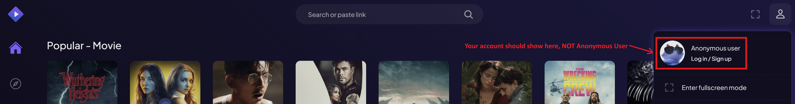
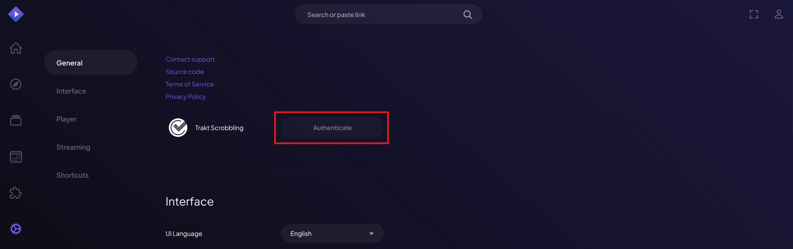
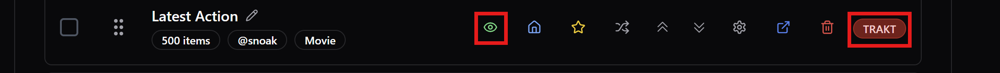
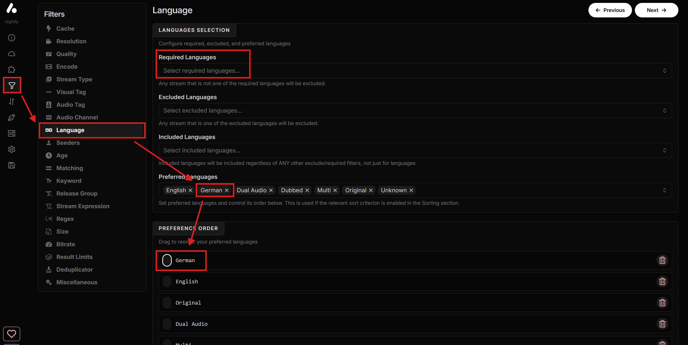
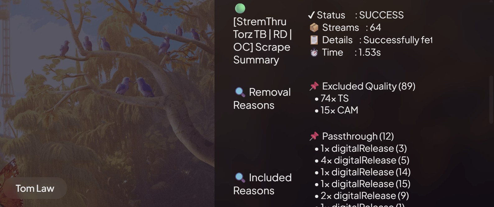
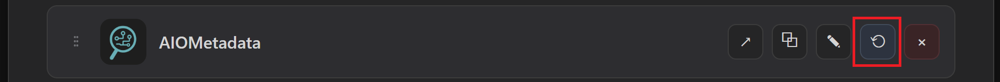
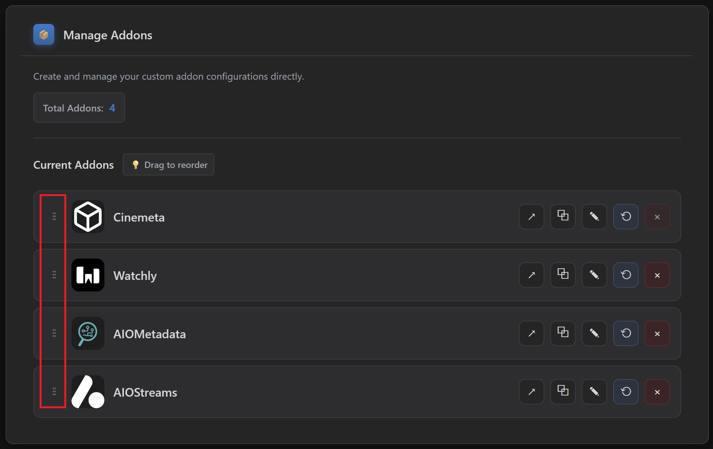

# ❓ Configuration Q&A

I am including this section for anyone who has any additional questions or is encountering any common issues. Most of this is already in the guide, but a lot of you skip them :), so I have extracted them here for you to find answers quickly:

## **I would like to share my setup with my friends and family. Is that possible?**
* It would depend on the approach you chose during the guide, and what "level" of sharing you want to achieve.
* You can install the same addons with the same configurations (same Manifest URL) onto multiple Stremio accounts. However, keep in mind:
   * If you used a Debrid, only *TorBox* allows you to use it with multiple IPs/streams (thus multiple accounts), *Real-Debrid* allows only one IP. You can proxy the *Real-Debrid* requests, but that needs self-hosting and it's beyond the scope of this guide. For *TorBox*, you can use its API key on multiple configurations as you see fit. Just don't abuse with it, it's fair use, if you resell or give it to your entire village, where they notice suspiciously high usage, you will get banned.
   * As such, if you're using *TorBox*, or a *P2P/HTTP* setup, you can share the same **AIOStreams** configuration, meaning you can install the same configuration directly by switching Stremio accounts on [**web.stremio.com**](https://web.stremio.com/) and installing it on each by pressing **Install** from the **Save & Install** tab on *AIOStreams*, like you did the first time.
   * **AIOMetadata** can also be shared, thus you can also install the same configuration directly by switching Stremio accounts on [**web.stremio.com**](https://web.stremio.com/) and installing it on each by pressing **Install** from the **Configuration** tab on *AIOMetadata*, like you did the first time. However, if you integrated your Trakt or Simkl account on *AIOMetadata*, keep in mind that these accounts will also be included. If you don't care about this, or you didn't integrate Trakt on *AIOMetadata*, then it's not a problem. This is separate from the **Trakt Scrobbling** you enabled directly on your Stremio account, which you should also do with separate Trakt accounts for each Stremio account, if you enable it at all.
   * **Watchly** is account-specific, because it binds directly to your Stremio account, so this addon you need to configure separately for each Stremio account. It will create catalogs based on your watch history, so it wouldn't make sense to do that based on the watch history of another account.
   * The *TMDB, TVDB, RPDB, Gemini* API keys can be shared, which allows *AIOStreams* and *AIOMetadata* to be shared as described in the first place.

## **I installed or removed addons, but nothing changes in Stremio. Am I in the wrong place?**
* Make sure you are signed into [**web.stremio.com**](https://web.stremio.com/) when installing or removing addons. Being logged into [**www.stremio.com**](https://www.stremio.com/) (account site) does not automatically log you into web.stremio.com.

## **I'm getting an error "No addons were requested for streams" when opening content on Stremio.**
* This means **AIOStreams** is not installed or configured correctly.
* Check if you installed it while logged in with your account on web.stremio.com. It should also be showing on Cinebye. Otherwise you installed it without being logged in so log in to web.stremio.com and install it again.
* In **AIOStreams** go to **Addons** and check if there are any addons (Torrentio, StremThru, etc.), and they are enabled. If there's no addons, then you didn't load the template provided in the guide. Please follow the AIOStreams setup again.

## **I still see old addons and clutter. How do I "reset" the account cleanly?**
* In [**Stremio Web**](https://web.stremio.com/): go to **Addons** and uninstall everything you can.
* Also remove the **Trakt Integration** addon (it is different from **Trakt Scrobbling**).
* **Cinemeta** and **Local Files** cannot be removed. You patch them via Cinebye.

## **I am not using a Debrid service and I want to stream via P2P torrents directly. What should I change, and what should I expect?**
* In **AIOStreams → Addons → Installed Addons**, disable **AnimeTosho**, **SeaDex**, and **Knaben** because they do not work without a Debrid service.
* You can still get anime results via the other scrapers, but they will be more limited. **SeaDex** and **AnimeTosho** usually increase the chances of finding better anime sources.
* When streaming via torrents, keep in mind speeds can be slow, and some links can be unwatchable if there are not enough peers.
* When torrenting, prefer links with a higher peer count (shown next to the **P2P** label).
* See also the next question below to enable HTTP streams in addition to torrenting.

## **I can't pay for a Debrid service, but I also can't use P2P torrenting because it seems to be very slow, or for other reasons.**
* The only remaining option would be direct HTTP streams, which are free, no Debrid, no torrent.
* When you load the template provided in this guide on **AIOStreams**, you can skip the "**Select Services**" step, and on the "**Template Options**" step, you need to enable the "**HTTP Addons**" toggle. This will install **Sootio**,  **WebStreamr**, and **HD Hub** addons, which provide direct HTTP streaming links. If you want you can additionally configure them with the pencil button to the right, e.g. for *WebStreamr* you can select specialty language providers.
* The HTTP streams will show with the 🌐 icon on the stream information view.
* The HTTP option might work very well sometimes, but it's not without its limitations. The streams you will find are more limited, the provider servers may be slow during high load times, and the quality may be lacking. But it's better than nothing I guess.

## **What's the difference between ⚡ DEBRID, 🧲 P2P, and 🌐 HTTP streams, and which should I choose?**
* You will choose which stream type you prefer during the *AIOStreams* template import.
   * **⚡ DEBRID** is paid, but fast, safest and most reliable. Activated by selecting a Debrid service when you import the template.
   * **🧲 P2P** is free, but slower and risky depending on the laws of your country. Activated automatically if you don't select a Debrid when you import the template.
   * **🌐 HTTP** is free and safe, but slower and less reliable than Debrid. Activated if you enable the *HTTP Addons* option when you import the template.
* *In case **P2P** is an issue in your country: If you use **Debrid** (paid) or **HTTP** (free) streams, you are generally safe and don't need a VPN. **Debrid** however is still the safest and most reliable solution.*

## **I don't understand what the icons (⚡,⏳,...) on the stream information view mean. How do I read them?**
* Go to [**🛠️ Additional Stuff**](7-Additional-Stuff.md#understanding-stream-information-view) to read the descriptions for each icon.

## **The icons of the stream information view are too plain/colorful, I would like more/less colors to differentiate.**
* Go to [**🛠️ Additional Stuff**](7-Additional-Stuff.md#alternative-stream-information-icons) on the extended guide to get an alternative template you can use instead.

## **I want Trakt progress syncing, but I do not want extra Trakt addons.**
* In [web.stremio.com](https://web.stremio.com/), sign in, and go to **Settings** and enable **Trakt Scrobbling** by connecting your Trakt account.
* Then uninstall the **Trakt Integration** addon from Stremio addons.

## **I want Anime sources, but I am not seeing them.**
* In **AIOStreams**: go to **Addons → Installed Addons** and enable **SeaDex** and **AnimeTosho** (installed only if you enabled a Debrid service and activated the Anime addons when you loaded the template).

* In **AIOMetadata**: go to **Search** and enable both **Anime Search Engine** switches.

## **I want subtitles in specific languages.**
* In **AIOStreams**: go to **Addons → Installed Addons**, edit **OpenSubtitles V3 Pro**, and set your subtitle language preferences there.

## **I don't understand how the streams shown to me are being sorted.**
* Go to [**🛠️ Additional Stuff**](7-Additional-Stuff.md#smart-stream-selection--sorting) to see the configured sort order.

## **I need non-English results to appear first in the results list.**
* In **AIOStreams**: go to **Filters → Language**.
* Add your language to **Preferred Languages**.
* Put it first in **Preference Order**.
* You can also add the language in the **Required Languages** if you want to ONLY show streams in that language, but keep in mind that streams that might have no language tags at all or tagged as "multi" will be filtered out.

## **I want my language to be prioritized even before Quality/Resolution.**
* In **AIOStreams**: go to **Sorting**.
* For the **Split by Cache: Cached Streams** list in the **Global** tab, move **Language** to the top (or wherever you want it).
* Repeat for the **Split by Cache: Uncached Streams** list.

## **I am not happy with the results, especially non-English. Is that all or could some have been filtered out?**
* Depending on the filenames of the streams, especially non-English results that don't follow the standard naming, could be more difficult to be parsed. The **Matching** option in **AIOStreams** helps to avoid any streams from the wrong show to be shown, using this filename information. You can try to disable it however to see if it helps. Go to **Filters → Matching** and disable it by turning off the **Enable** toggle in all three sections:
   * *Title Matching*
   * *Year Matching*
   * *Season/Episode Matching*
* Before disabling it entirely, you can try first to simply disable the **Strict** toggles and check, otherwise disable it entirely. Keep in mind however that sometimes wrong results might be shown.

## **Results are coming in too slowly. How can I speed it up?**
* In **AIOStreams**: go to **Addons → Addon Fetching Strategy** and try **Dynamic**, leave the **Exit Condition** as is, then save your config.
* If you notice it misses good links, switch back to **Default**.

## **I feel like I am getting too few good results. What should I change?**
* If you set fetching to **Dynamic** (**AIOStreams → Addons → Addon Fetching Strategy**), try switching back to **Default**.
* Make sure you have enough scrapers enabled.
* Go to [**🛠️ Additional Stuff**](7-Additional-Stuff.md#smart-stream-selection--sorting) to see the optimizations configured in the **AIOStreams** template provided in this guide and how to make changes to them.

## **There are some numbers being shown on the streams list instead of the usual details, and I am being redirected to GitHub when I click them.**
* If you see something like the picture below, they are statistics showing information about the results returned from the scrapers, including what was filtered out, what was included, time it took for each, and more.
* They are shown only when the scrapers did not return any results, or when irrelevant, low quality, or bad results in general have been filtered out already, leaving no results available. This way you can try to figure out why there are no results.
* They are only informational, but they are clickable because they have to be for Stremio to show them. However DO NOT click them because you will be taken to the *AIOStreams* GitHub page, which is unnecessary.

## **I cannot save because it says "Knaben/SeaDex/AnimeTosho requires a Debrid service…".**
* If you are not using Debrid: disable **Knaben**, **SeaDex**, and **AnimeTosho** in **Addons → Installed Addons**, then save again.
* If you want Knaben/SeaDex/AnimeTosho, you will need a Debrid service.

## **I do not have an RPDB subscription. What key should I use?**
* Use the free RPDB key: `t0-free-rpdb` (works for both AIOStreams and AIOMetadata integrations as described in the guide).

## **I don't want to get a Gemini key since it's optional, but AIOMetadata seems to require it.**
* in **AIOMetadata** go to the **Search** tab and disable **AI-Powered Search**, then you will be able to save the configuration.

## **Titles and descriptions in Stremio are in English. Can I change the metadata language?**
* In **AIOMetadata**: go to **General** and change **Display Language**.

## **I cannot save the AIOStreams configuration and see "Failed to fetch manifest..." and/or "502 - Bad Gateway".**
* This usually means one or more addons are temporarily offline.
* Go to **Addons → Installed Addons**, disable the problematic addons mentioned on the error message, and save the configuration so you can continue the guide.
* At a later time, return to AIOStreams, enable the addon again, and try to save it if it's back online.

## **Some catalogs show "Failed to fetch" or appear empty in Stremio.**
* This is often caused by Trakt being temporarily down or rate limiting requests.
* Just wait it out, it will work later. No reconfiguration is needed in most cases.

## **I cannot complete the Trakt integration step on AIOMetadata.**
* Trakt has enforced strict rate limits lately, and all public instances are affected.
* If it says "Instance owner has not yet set up the Trakt integration." when you click the Trakt button, then it means Trakt integration has been disabled by the instance provider. If you still need Trakt, you're going to need to do the AIOMetadata configuration with another instance.
* If it's giving errors while integrating, you can try at a later point and hope it works, or do the AIOMetadata setup with another instance.
* Alternatively, you can leave Trakt integration disabled, and hide the Trakt catalogs on the list (marked with a red **Trakt** tag on the right) by clicking the green eye icon for each. I know it's not ideal since you created a Trakt account already, but there's nothing we can do about it. You can still add other catalogs from the other sources there, but it's outside the scope of this guide.
* There are also good alternatives to Trakt if you disable it, both for watch history tracking, and curated catalogs, which you can check out on [**🛠️ Additional Stuff**](7-Additional-Stuff.md#enriching-your-catalogs-trakt-alternatives).

## **I added or changed AIOMetadata catalogs, but they do not show in Stremio.**
* Go to **Cinebye**, authenticate, and then in **Manage Addons** click the **Refresh** icon next to **AIOMetadata**.

## **I get an error installing AIOMetadata: "AddonsPushedToAPI Max descriptor size reached".**
* You likely have too many catalogs enabled.
* Disable some catalogs in AIOMetadata, **Save Configuration**, then try **Install** again.

## **I'm getting an error "No addons were requested for this meta!" when opening content on Stremio.**
* This means **AIOMetadata** is not installed or configured correctly.
* Check if you installed it while logged in with your account on web.stremio.com. It should also be showing on Cinebye. Otherwise you installed it without being logged in so log in to web.stremio.com and install it again.
* Make sure **Catalog Mode Only** in AIOMetadata **Configuration** tab is disabled.

## **I want Watchly recommendations to show near the top of Stremio.**
* Go to **Cinebye**, authenticate, and then in **Manage Addons** reorder addons so **Watchly** is **second** (after Cinemeta, before AIOMetadata), then click **Sync to Stremio**.

## **I want more ready-made catalogs inside AIOMetadata.**
* In **AIOMetadata → Catalogs**, click the **Trakt** button and search for lists from user **snoak** to import more lists.
* For even more curated catalogs, you can integrate **MDBList** and get lists from there. Check out how in [**🛠️ Additional Stuff**](7-Additional-Stuff.md#enriching-your-catalogs-trakt-alternatives).

## **CouchMoney only created two lists for me. Is that normal?**
* Yes, the guide notes Trakt free users are limited (CouchMoney will create two lists). If you want more extensive recommendations inside Stremio, use **Watchly**.

## **I used the old "ForTheWeak" (fortheweak.nhyira.dev) AIOStreams/AIOMetadata domains. What do I need to do after the domain migration?**
* **AIOStreams:** redo Step 3 on one of the new instance links and use the updated template.
* **AIOMetadata:** uninstall AIOMetadata from **Addons** in [web.stremio.com](https://web.stremio.com/), open the new AIOMetadata instance, sign in with your existing UUID/Password (accounts were migrated automatically), **Save Configuration**, **Install**, then go to Cinebye and reorder addons again and **Sync**.

## **I forgot where to save changes in AIOStreams or AIOMetadata. What is the one rule?**
* **AIOStreams:** ALWAYS save in **Save & Install → Save**.
* **AIOMetadata:** ALWAYS save in **Configuration → Save Configuration**.

## **I installed the setup in Stremio. Does it automatically work in Nuvio too?**
* No. **Stremio** and **Nuvio** are separate apps with separate accounts.
* If you installed AIOStreams or AIOMetadata in Stremio, they will not automatically appear in Nuvio.
* For Nuvio, you need to copy the **Manifest URL** from AIOStreams and AIOMetadata after saving each configuration, then install those URLs inside **Nuvio → Account → Addons → Add Addon**.
* However, you can reuse the same configuration you did for Stremio and install it directly on Nuvio, you don't need to reconfigure the addons.

## **Do I need Cinebye for Nuvio?**
* No. **Cinebye is only for Stremio**.
* In Stremio, Cinebye is used to remove Cinemeta clutter and control addon order.
* Nuvio has its own system for addons, profiles, collections, layout settings, and catalog behavior.
* For Nuvio, as instructed in step [**🧹 5. Configuration**](5-Configuration.md#-nuvio), the important parts are:
   * Install the addon **Manifest URLs** directly in Nuvio.
   * Add the **Nuvio Collections Pack** if you want the organized home screen.
   * Enable **Follow addons order**.
   * Enable **Prefer meta from external addon**.

## **Should I remove Cinemeta in Nuvio?**
* If you want to follow this setup cleanly, yes, I recommend removing **Cinemeta** from Nuvio if it is installed and removable.
* The point of this setup is to let **AIOMetadata** handle metadata and catalogs.
* If Cinemeta stays active, you might see duplicate catalogs, wrong metadata priority, or a less clean setup.

## **My Nuvio metadata looks wrong or different from AIOMetadata. What should I change?**
* In the **Nuvio app**, go to **Settings → Layout → Detail Page**.
* Enable **Prefer meta from external addon**.
* This tells Nuvio to prefer metadata from addons like **AIOMetadata**, instead of falling back to its internal/default metadata behavior.
* Also make sure AIOMetadata is installed and enabled on the correct Nuvio profile.

## **My Nuvio home catalogs are not in the order I expected.**
* In the **Nuvio app**, go to the **Addons** tab.
* Open **Reorder home catalogs**.
* Enable **Follow addons order**.
* This should make Nuvio follow the addon/catalog order more consistently.

## **I added the Collections Pack on Nuvio, but they are not showing any titles.**
* The most likely reason is that **AIOMetadata** was not configured and installed in Nuvio first.
* The Nuvio Collections Pack does not magically create the catalogs by itself. It organizes and groups the catalogs that already exist in your Nuvio setup, which in this setup are provided by *AIOMetadata*.
* So, before adding the Collections Pack, you need to complete the [**4. 🔎 AIOMetadata**](4-AIOMetadata.md) step:
   1. Import the [**configuration**](../templates/AIOMetadata-All.json) file from this guide into *AIOMetadata*, which includes the catalogs needed for the collections.
   2. Save the AIOMetadata configuration.
   3. Copy the **Manifest URL**.
   4. Install that Manifest URL in **Nuvio → Account → Addons → Add Addon**.
   5. Then add the **🍿 Nuvio Perfect Collections** Pack.
* The collections need to find the matching *AIOMetadata* catalogs inside Nuvio. If those catalogs are not installed first, there is nothing for the collections to connect to.
* Also check that both *AIOMetadata* and the collections were added to the correct **Nuvio profile**.

## **Should I choose Merge or Replace when adding the Nuvio Collections Pack?**
* Choose **Replace profile collections** if you are starting fresh and want the cleanest result.
* Choose **Merge by matching IDs** if you already have collections and do not want to lose them.
* For most beginners following this guide from zero, **Replace profile collections** is probably the better option.

## **What are Dynamic Backdrops, and do I need to update them manually?**
* **Dynamic Backdrops** are an exclusive feature of this setup, developed by me for the Nuvio collections.
* Instead of using random static collection images, the backdrops are generated based on the actual titles inside the related catalogs.
* For example, a streaming provider, genre, decade, or theme collection can have a backdrop that better matches its current content.
* If your Nuvio collections use the image URLs from this guide, you normally do not need to manually replace them every time. When the assets are refreshed in the repository, your setup can benefit from the updated images.

## **Should I use Nuvio Plugins or AIOStreams HTTP Addons?**
* Start with **AIOStreams** first.
* If you use **Debrid** or **P2P**, you probably do not need Nuvio plugins.
* If you use only **HTTP** streams and you are not getting enough results, then Nuvio plugins can help as an extra source layer.
* Just keep in mind that plugins do not go through AIOStreams, so they will not have the same filtering, sorting, language handling, or stream formatting.

## **Can I share my setup with friends or family?**
* Yes, but it depends what exactly you want to share.
* You can share or reuse the same **AIOStreams** and **AIOMetadata** configuration and install them as-is on other accounts, but keep in mind that those configurations may include your API keys or connected accounts. If you **ONLY** share the Manifest URL for others to install on their accounts, then your API keys are safe, since they don't have access to the internal addon configurations.
* However also keep in mind that if you have personalized lists, such as **Trakt Recommendations** in *AIOMetadata*, then the other accounts will also get those lists shown.
* If you use **TorBox**, sharing is more practical because it supports multiple parallel usage depending on your plan.
* If you use **Real-Debrid**, be careful because it is much more restrictive with simultaneous usage.

## **Do I still need Trakt in Nuvio if I already connected Trakt in Stremio?**
* Yes, if you want Trakt features inside Nuvio too.
* Stremio Trakt Scrobbling is connected to your **Stremio account**.
* Nuvio has its own account and app settings, so you should also connect Trakt inside Nuvio if you want watch history, progress, and recommendations there.

## **I use Nuvio. Do the Stremio-specific Q&A answers still apply to me?**
* Some of them do, some of them don't.
* Anything related to **AIOStreams**, **AIOMetadata**, Debrid, P2P, HTTP, subtitles, language filters, matching, sorting, and scraper behavior still applies, because those settings are inside the addons.
* Anything related to **Stremio Web**, **Cinebye**, **Trakt Scrobbling in Stremio**, or **Sync to Stremio** is Stremio-specific.
* For Nuvio, think in terms of **Manifest URLs**, **profiles**, **addons**, **collections**, **plugins**, and **app settings**.
